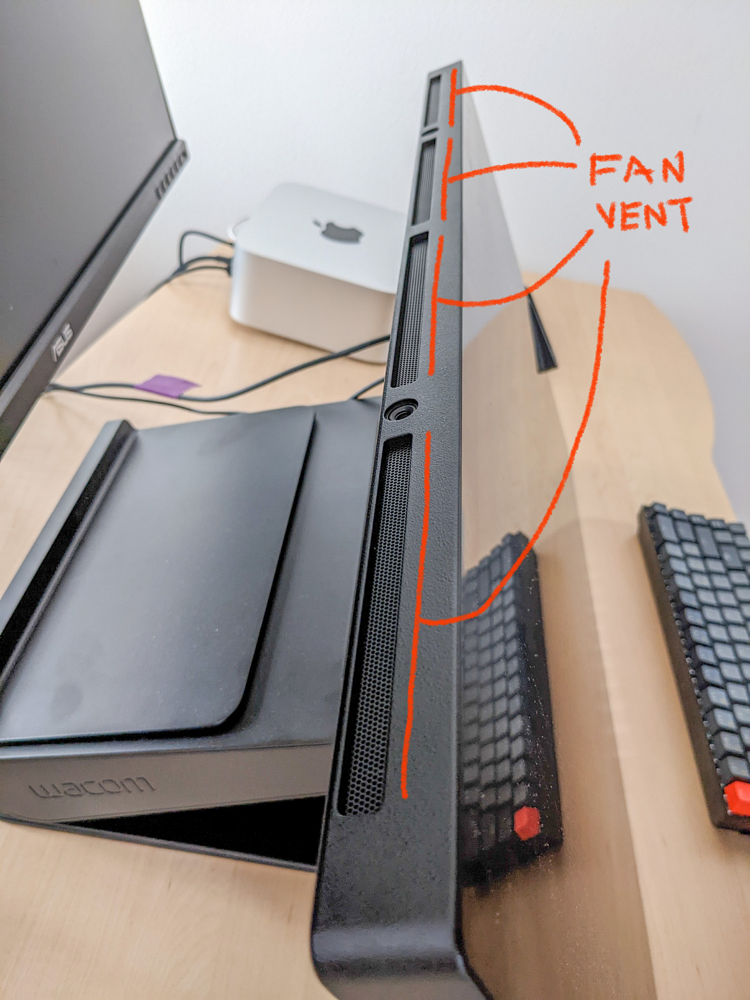

# 7P notes: Wacom Cintiq Pro 27 (DTH-271)

## Summary

* The Wacom Cintiq Pro 27 is the best pen display ever made. With a price of $3500 it is also the most expensive pen display ever made.
* This Cintiq is an excellent device - except for the irritating fan noise. I love drawing with it. Drawing experience is excellent. But only incrementally and subtly better than previous models.
* **For creative professionals** - who deeply care about color this may be a worthwhile and useful purchase that replaces the need to buy a pen display and a reference monitor
* **For everyone else** - especially if you don't have professional color requirements, the value you get may not justify the cost.&#x20;

## Notes

* This was a personal purchase.&#x20;
* This was not a review unit. I bought it from the wacom.com online store.
* I have no relationship to Wacom.

## Wacom pre-launch demo event

* I attended Wacom's demo event on Oct 5 2022 before the product was launched.&#x20;
* This wasn't an exclusive event. I registered for it like everyone else when Wacom publicly revealed the event.
* Wacom published the Q\&A from the demo event here: [https://content.wacom.com/acton/attachment/43270/f-82fbd755-3ca6-41b0-8603-0d7b59d041c2/1/-/-/-/-/Wacom%20Cintiq%20Pro%2027%20Product%20Event%20Q%26A\_Oct%202022.pdf?sid=TV2:AJoJnUTl8 ](https://content.wacom.com/acton/attachment/43270/f-82fbd755-3ca6-41b0-8603-0d7b59d041c2/1/-/-/-/-/Wacom%20Cintiq%20Pro%2027%20Product%20Event%20Q%26A\_Oct%202022.pdf?sid=TV2:AJoJnUTl8)

## User manual

[http://101.wacom.com/UserHelp/en/TOC/DTH271.html](http://101.wacom.com/UserHelp/en/TOC/DTH271.html)

## Other reviews

* Many others have created very thoughtful reviews
* Please consult them to get a more complete understanding of this tablet
* You can find other reviews of the Wacom Cintiq Pro 27 in [Wacom reviews](../../).

## Components

| Component                  | Model number | Notes                             |
| -------------------------- | ------------ | --------------------------------- |
| Wacom Cintiq Pro 27        | DTH271       |                                   |
| Wacom Pro Pen 3            | ACP50000DZ   | Included with Wacom Cintiq Pro 27 |
| Wacom Pro Pen 3 tray       | ACK44827Z    | Included with Wacom Cintiq Pro 27 |
|  Wacom Cintiq Pro 27 Stand | ACK64801KZ   |                                   |

## **Drawing experience**

### **Summary**

* The best drawing experience there ever has been with a pen display.
* However, the improvements are minor and incredibly subtle over previous generations.&#x20;

### Active area / Display size

* At 27" diagonal for both the active area and display, this model is one of the largest pen displays ever made.&#x20;
* Only two models have come close in size.
  * The Wacom Cintiq Pro 32 (DTH-3220) first released in 2018.
  * The discontinued Cintiq 27HD (DTK-2700) first released in 2015.
* The available largest size from competitors is 24"

#### Specs

* size = 596 x 335 mm (23.5 x 13.2 in)
* diagonal size = 26.9 in (68.3cm)
* aspect ratio: 16x9

### Pointer lag&#x20;

* **Background:** [**lag**](../../../../guides/core-features/lag.md)
* **In absolute terms**, The Cintiq Pro 27 has shows moderate pointer lag.&#x20;
  * Pen tablets (like the Intuos Pro Large PTH-860) have much less lag than this Cintiq. These have EXCELLENT lag.
  * Apple iPads have much less lag than this Cintiq, but not quite as little as pen displaces. These have EXCELLENT log.
* **In terms relative to other pen displays**, The Cintiq has GOOD (but not GREAT) pointer lag.&#x20;
* **Affect of the 120Hz refresh rate** - The 120Hz refresh rate of the display panel only minimal improved the perception of lag. This surprised me. I expected the 120Hz to make a bigger difference based on my experience with the iPad Pro and Apple Pencil 2 which also uses a 120Hz refresh rate.

### Tilt

* More here: [**Pen tilt**](../../../../guides/core-features/pen-tilt.md)&#x20;
* Tilt support with the Cintiq Pro 27 is standard for Wacom: EXCELLENT.
  * Tilt is smooth, accurate, and responsive.
  * Tilt works correctly at edges and corners.
* Wacom has improved overall tilt experience with the shape of the Pro Pen 3. The pen has a sharper tip section, making it physically possible to get to more tilt values.

### Pen tracking accuracy

* Background: [**pen tracking**](../../../../guides/core-features/pen-tracking.md) &#x20;
* Wacom does not publish pen tracking accuracy numbers
* But we can compare it to other tablets that do have published numbers
* Here are the accuracy numbers for the Huion Kamvas Pro 24 4K (GT2401) as
  * \+/- 0.5 mm at center
  * \+/- 3mm at corner
  * I think these numbers are accurate for the Huion
* The Cintiq pro 27 - just like every other pen display - has some non-uniformity.&#x20;
  * Compared to any other pen display out there the uniformity is VERY GOOD.
  * The amount of inaccuracy at the edges and corners is very low - clearly better than the Huion Pro 24 4K model.

### Parallax

* Background: [**parallax**](7p-notes-wacom-dth271.md#parallax)
* An iPad Pro has EXCELLENT parallax (very little parallax)
* The display of the Cintiq Pro 27 has VERY GOOD parallax due to its full lamination but clearly not as good as an iPad Pro
* The Cintiq Pro 27 parallax is nothing special for modern pen displays. Many pen displays are fully laminated lately.

### Pressure&#x20;

Pressure is a feature of the pen you use with the tablet.

See my [**notes on the Wacom Pro Pen 3**](../../wacom-pen-models/7p-notes-wacom-pro-pen-3.md) that comes with the tablet.

### **Diagonal wobble**

* Background: [diagonal wobble](7p-notes-wacom-dth271.md#diagonal-wobble)
* In my testing, the Cintiq Pro 27 has GOOD-to-OK (i.e. low) diagonal wobble. See comparative samples here: [diagonal wobble](7p-notes-wacom-dth271.md#diagonal-wobble).&#x20;
* NOTE: Originally I had ranked the Cintiq Pro 27 as having VERY GOOD wobble. Upon further testing with many other tablets, I havve downgraded the ranking.
* As tablet that costs $3500 I think The Cintiq Pro 27 tablet should have better (less) diagonal wobble. There are other tablets out there at various price levels that are better:
  * Wacom Intuos PTH-860
  * Huion Kamvas Pro 24
  * Huion Kamvas 13 and XP-Pen Artist 13 (2nd Gen).

### Diagonal wobble&#x20;

Rating: OK&#x20;

<figure><figcaption></figcaption></figure>

Compare to some other diagonal samples linked from here: [diagonal wobble](../../../../guides/core-features/diagonal-wobble/)&#x20;

## **Display**

### Specs

* native resolution: 3840 x 2160&#x20;
* aspect ratio: 16x10
* contrast ratio: 1000:1
* refresh rate: Up to 120Hz
* Response time: 10ms
* panel tech: IPS

### **Bit depth**

* Supports up to 10 bits per RGB channel (30 bits for each pixel) giving 10 Billion colors
* Also works at standard 8 bits per RGB channel (24 bits for each pixel) giving 16.7 unique colors
* I only used it at 8 bits per channel

### **Brightness**

* 400 cd/m2
  * NOTE: 1 cd/m2 = 1 nit
* Overall relatively bright for a pen display, not as bright as many of the modern displays in the market.
* In comparison:
  * Cintiq pro 27 -> 400 cd/m2
  * Apple iPad Pro (11 inch) (4rd gen) -> 600 cd/m2
  * Surface Pro 8 -> 452.8 cd/m2
  * Huion Kamvas Pro 24 4k -> 200 cd/m2&#x20;
* In practice seemed bright enough for drawing. I certainly did not find it dim
* However, if you place it next to a device like an iPad Pro or Surface Pro 8, then it's clearly not as bright.

### **Refresh rate**

* Supports up to 120Hz
* Works at 60Hz
* Works at 30Hz - you do NOT want to use it at this refresh rate
* NOTE: Pay attention when you plug it in, depending on how it is connected to your PC, you could end up with a lower refresh rate. Always check the refresh rate being used when you plug it in. Don't assume you are getting 120Hz.
  * For example: When connecting to a Surface Pro 8, via the surface dock, and a miniDP to HDMI adapter limitation I could only achieve 30Hz due to limitations in the adapter.

### **Anti-glare treatment and sparkle**

* Background: [Anti-glare sparkle](../../../../guides/pen-displays/anti-glare-sparkle.md)&#x20;
  * Reflections on your pen display would make it difficult to draw. To reduce reflections, manufacturers give an anti-glare (AG) treatment to the display/ The AG treatment is either etched glass or an AG film applied on top of the glass
* The Cintiq Pro 27 uses AG etched glass
* The AG sparkle from the etched glass is GOOD (i.e. low) for a display of this size and resolution&#x20;
  * AG Sparkle is only slightly visible with eyes 4" away from glass&#x20;
  * AG Sparkle is not visible at my normal drawing distance with eyes 13" from glass

### **Glass texture**

* The AG etching provides a subtle texture for your pen to grip against. Your fingers won't notice it but it definitely helps the pen feel connected to the tablet.&#x20;
* It does NOT have that **slippery** feeling that comes with the iPad Pro with the Apple Pencil.

### **Dead pixels**

None observed in my model

### **Blacks**

Deep black to my eyes - not dark grey.

## Color Support

I don't have a much background in color - especially in a professional sense. Here I am just listing the specs.

### Gamut

* 98% DCI-P3&#x20;
* 99% Adobe RGB

### Color modes

Using the OSD you can place it into different color modes

* Native (the default)
* AdobeRGB
* DCI-P3
* Rec.709
* Rec.2020
* Display P3
* sRGB
* EBU
* PQ Rec.2100
* PQ DCI
* HLG Rec.2100
* Custom

My usage: I left it at **Native**.

## **Connections**

### **Ports**

* 1x mini DisplayPort
* 1x HDMI
* 2x USB Type-C
* 1x USB Standard-A
* 1x power

### **How I connected it to my PC**

* I used two cables
  * Power cable -> goes to wall
  * USB-C cable (provided in the box) -> to connect to the thunderbolt 4 ports on my PC. The USB C cable provided display signal + data.
* I used the Cintiq with
  * Mac Studio
  * Surface Pro 8&#x20;

## **Express keys**

* Total of 8 keys. 4 on left. 4 on right.
* If you mount the pen holder on the left or right of the tablet, you will lose access to the express keys on that side.
* The express keys cannot be used to enable/disable touch. You have to use the touch switch on the back of the device.

### My usage

* I prefer not to use express keys in general.&#x20;
* I rely on a TourBox device so express keys don't help. I have my non-drawing hand on my Tourbox device so the buttons aren't really very useful for me.

## **Mounting**

* You cannot use the device without mounting it to something
* On the back it has a standard 100mm VESA mount
* You can either
  * Use the Cintiq Pro 27 Stand (sold separately at $500)
  * Any compatible VESA display arm (like an Ergotron HX) that hold sup to 20lbs
  * Wacom Flex Arm + Wacom Flex Arm Adapter

## **The Cintiq Pro 27 Stand**

### Stability

* It wobbles a bit if you press on it.
* I mitigate the wobble by placing something under it's bottom edge. That provides some additional support to keep the tablet very still.

### Rotation

* The Z axis is a line between your eye and surface of the tablet
* Can rotate +/- 20 degrees
* Can NOT rotate the display into portrait mode

### Tilt

* Typically you will use it with the tablet facing upwards somewhat so you can comfortably draw
* You CAN angle it so that the surface is **perpendicular to the floor**.&#x20;
  * However, then essentially the bottom edge is directly touching your desk. So it isn't very useful in that position if you just want to use it as a monitor with this stand.
* You can angle it so that the surface is facing completely upwards and **parallel to the floor**.
  * .png>)

### Height adjustability

* Some limited height adjustability - cannot lift the the display very high
* If you need to use it like a normal monitor -you should get an arm instead of using the stand

## Fans

* The Cintiq Po 27 contains two fans according to Wacom.
  * Note that the Cintiq Pro 24 had 4 fans.&#x20;
* I asked Wacom why it need fans.&#x20;
* Wacom's reply: _"Unlike a typical desktop monitor or touch-screen, Wacom pen displays are designed to have a hand on them all the time, so heat is a serious factor for long-term usability and comfort. On most smaller tablets and displays, enough heat can escape from the back, so it's not an issue. However, the larger and brighter the display, the more heat it will produce. Heatsinks are a common device used to normalize temperatures and dissipate heat. Our displays use heatsinks to help dissipate heat, and an active heatsink requires a fan to work effectively"_
* It is still unclear to me why the Cintiq Pro 27 needs fans when many other devices don't. For example, is the Huion Pro 24 4K is silent and is just very slightly warm to the touch. There are many other examples of devices.&#x20;
*   The fans are located on the top edge of the display

    <figure><figcaption></figcaption></figure>

### Fan noise

#### Duration

* The Fan noise is **always on** if the display is powered
* Fan noise during power up or wake from sleep
  * Will be loud for a few seconds
  * Will be silent for a few seconds
  * Then will settle in on its constant sound

#### Control over fan noise (there is none)

* Changing brightness does not affect Fan
* There is no way to control the fan speed.
* I hope and encourage Wacom to release an update that gives some selective control over the fan.&#x20;

#### Subjective perception of fan noise

* In a quiet environment you will notice the fan noise
* The noise does bother me. It is louder than any device I have in my office except my PC when I am gaming at 4K.
* Here's what it sounds like: [https://twitter.com/TheSevenPens/status/1579912655581876225?s=20\&t=Fv8rNtUcS0wdUeAXV\_MwJg ](https://twitter.com/TheSevenPens/status/1579912655581876225?s=20\&t=Fv8rNtUcS0wdUeAXV\_MwJg)
* I mitigate the fan noise perception sometimes by using earbuds with Active Noise Cancellation. I use Google Pixel Buds pro which completely mask the sound. As much as this solution does work, I don't think the future of using expensive creative equipment should require me to put something in my ears.
* I would STRONGLY prefer the Cintiq Pro 27 to be silent or at least much quieter even if it has run slightly warmer.&#x20;

#### Objective measure of fan noise

* I had originally hoped to use a device to measure the noise, but when I went to research these devices I learned that consumer-level devices and apps are unreliable.

## Pen Compatibility&#x20;

* Tested and confirmed that these older pens work fine with the Cintiq Pro 27
  * Wacom Pro Pen 2 (KP504E)
  * Wacom Grip Pen (KP-501E)
  * Wacom Art Pen (KP-701E)
* [Wacom's list of supported pens for the Cintiq Pro 27](https://support.wacom.com/hc/en-us/articles/9170502251927-What-are-the-accessory-pens-I-can-use-with-the-Wacom-Cintiq-Pro-27-2022-)

## Wacom Pro Pen 3

The Wacom Cintiq Pro 27 comes with the Wacom Pro Pen 3.

The Wacom Pro Pen 3 is a very normal EMR pen that lives up to previous models in terms of quality. And may be slightly better than the Wacom Pro Pen 2.

See my [**notes on the Wacom Pro Pen 3**](../../wacom-pen-models/7p-notes-wacom-pro-pen-3.md).

## Touch&#x20;

* All Cintiq Pro 27 models support touch
* You can enable/disable touch with a button on the rear of the display
* **Quality of touch support: Past vs Present**
  * Historically I have never been happy with touch support in Intuos Pro models.&#x20;
  * The touch support in the Cintiq Pro 27 is very much improved.&#x20;
* **The overall touch experience**
  * **When connected to a Windows computer** - **VERY GOOD**. Windows has had extensive built in touch support for a decade now and it shows when using this device. It feels very natural. However it did suffer from occasional glitchy behavior. For example sometimes it "lost" a ping-to-zoom gesture and I had to repeat the gesture again to get it to work. If you are used to working with a Microsoft Surface then I would say the Surface touch experience is clear better than the the Wacom Cintiq Pro 27.
  * **When connected to a Mac** - **OK**. It works well, but MacOS is not built to work with touch like an iPad is. So please don't expect the touch support to make your Mac feel like an iPad.
  * **Palm rejection** is much improved. But still didn't reject my palm enough. So as I tried to pinch and zoom in Clip Studio Paint I would often find that I had accidentally drawn a stroke. I mostly disabled touch while using the device because of this reason.&#x20;

## Buttons on back (not the Express keys)

There are three buttons on the tablet (top right if you are facing the tablet)

<figure><figcaption></figcaption></figure>

These buttons are the

* power
* show/hide OSD
* slider to control touch

These work fine.

My only nitpick here is that the power button is very close to the show/hide OSD button and also they are difficult to distinguish by touch. So, I am always a little nervous that instead of bringing up the OSD that I am about to turn off the tablet.

## Build quality

* The Cintiq Pro 27 - excellent
* The Cintiq Pro 27 stand - excellent
* The Pro Pen 3 - excellent
* The pen holder - feels cheap and finnicky. Does not open elegantly. The lid will unelegantly pop off.&#x20;

## Cost

* There's no getting around the cost. it is extremely expensive.
* $3500 for the pen display itself, and you'll need to separately purchase a stand.
* The Wacom stand for this device itself costs $500.&#x20;

## Protecting your investment

### Protecting the screen

Generally people are concerned about scratching up the glass surface. And when a tablet costs so much that makes sense.

I am still searching for how we can give some added protection to the surface - like some kind of protective film. I don't have an answer to this yet. If anyone has suggestions, let me know.

### Warranty&#x20;

The tablet comes with a 2 year warranty (at least in the US).

However, an extended warranty can be purchased. Here's what Wacom had to say about it from the Oct 5 demo event.

_"... we currently offer a 2-year, 3-year, and 4-year extended warranty on the Wacom eStore (displayed above the Add to Cart button). This is in addition to the 2-year manufacturer warranty, so you could have up to 6 years of extended coverage. It's also possible that other retailers may offer their own extended service packages."_

## Who should buy it

Ultimately this device seems targeted at really high-end professional scenarios that involve dealing with color in specialized ways.

* **Beginner** -> I don't think it makes sense to get. You won't benefit from it much. You could spend the same money ($3500) and get a PC, a 4K pen display, mounting arm, and more.
* **Intermediate** -> Same as beginner answer.
* **Experienced** user of a Cintiq Pro 24 or 32 model -> YES, IF you are really really need its pro color support

## Wacom's use case for purchasing this pen display

During the Oct 5 2022 Demo event, Wacom said that if you are working with reference monitors and are drawing on a pen display, you should consider getting this single device instead. You can use it like a normal reference monitor and when you need to draw, you just pull it closer and start drawing.

I'm not an expert in this scenario, so I can't comment on that, but it seems reasonable.

Ultimately we need to hear from color professionals to see if indeed the Cintiq can be used as a reference monitor.

## Reddit threads

* [https://www.reddit.com/r/wacom/comments/14fmkvv/i\_am\_disappointed\_to\_cintiq\_pro\_27/](https://www.reddit.com/r/wacom/comments/14fmkvv/i\_am\_disappointed\_to\_cintiq\_pro\_27/)&#x20;
* [https://www.reddit.com/r/wacom/comments/15zgsoq/for\_the\_few\_that\_are\_thinking\_about\_getting\_the/](https://www.reddit.com/r/wacom/comments/15zgsoq/for\_the\_few\_that\_are\_thinking\_about\_getting\_the/) &#x20;

## Alternatives

### Wacom Cintiq Pro 24 ($2500)

With the price of the Cintiq Pro 27, some people are now simply deciding to go with the older Cintiq Pro 24 model.

Key points

* Same brand
* 24" size close to 27" size
* Some people prefer the wider bezel of the Cintiq Pro 24
* Cintiq Pro 24 has EXCELLENT drawing experience
* Also supports 4K resolution
* We expect Wacom will eventually  enable the Pro Pen 3 on the Cintiq Pro 24. Though they have not specifically committed to this yet.
* The Cintiq Pro does have a known fan noise issue. Some people say it's very quiet and some people say it is very loud.

### Huion Kamvas 24 Pro 4K ($1300)

I own and use Huion Kamvas 24 Pro 4K. So my comments here are based on my direct experience with this model. More here on this tablet: [7P notes on Huion models](broken-reference).

Comparing the Wacom Cintiq Pro 27 the Huion Kamvas 24 Pro 4K.&#x20;

The Cintiq Pro 27 is **overall clearly superior**.

**The advantages of the Cintiq Pro 27:**&#x20;

* has a brighter screen
* supports touch
* higher display refresh rate (120Hz vs 60Hz)
* more flexible connection options
* superior color management&#x20;
* less AG sparkle

**However the Kamvas 24 Pro 4K is a terrific value for the price**:&#x20;

* Supports the same 4K resolution
* Screen is bright enough
* 60Hz refresh rate is fine for doing art. Every other pen display is at 60Hz.&#x20;
* The Kamvas drawing experience is pretty good - the Cintiq is just a bit better.
* The Kamvas is completely silent. The Cintiq has constant fan noise that cannot be turned off or turned down.
* The  Kamvas has built-in foldable legs to hold the tablet at an angle and is also VESA mountable to other stands or arms.&#x20;

The Huion may represent a better practical choice for many people because the Huion provides 90+% of the Wacom experience - especially if you don't need the sophisticated color management of the Cintiq - for a substantially reduced price

* Cintiq Pro 27 -> $3500
* Kamvas Pro 24 4K -> $1300

### Xencelabs Pen Display 24

My experience with this tablet is here: [7P notes on Xencelabs tablets](broken-reference)&#x20;

The Cintiq pro is superior in general to the Xencelabs Pen Display 24.

Some key differences:

* The Xencelabs Pen Display 24 has clearly better edge and corner accuracy
* The Xencelabs had clearly more pointer lag than the Cintiq Pro 27. This is something Xencelabs needs to be better at.&#x20;

### XP-Pen alternatives

I haven't tried a comparable XP-Pen model, so I can't comment on any comparison.

## Miscellaneous

As an experiment I connected an iPad Pro to the Cintiq Pro 27 using a Thunderbolt 3 cable.

Specific iPad Pro model used: Apple iPad Pro (11 inch) (4rd gen)

**What worked**

* I was able to get the iPad Pro to use the display of the Cintiq Pro 27

**What did not work**

* The iPad Pro was not able to use the touch support of the Cintiq Pro 27 at all.
* The image on the Cintiq Pro 27 looked washed out - and I tried all color profiles on the Cintiq Pro 27. This seems to be an issue with the iPad Pro and some displays in general. See [https://www.reddit.com/r/iPadPro/comments/15a5cdf/m1\_ipad\_pro\_washed\_out\_colors\_using\_external/](https://www.reddit.com/r/iPadPro/comments/15a5cdf/m1\_ipad\_pro\_washed\_out\_colors\_using\_external/)&#x20;

## Change log

* 2023/10/15 - Add info about connecting an iPad Pro to the Cintiq Pro 27
* 2023/08/23 - Add link to reddit thread about the stand
* 2023/06/21 - Moved notes on Wacom Pro Pen 3 to a separate doc
* 2023/05/30 - Added info on the Xencelabs Pen Display 24&#x20;
* 2023/05/30 - Added link to the Wacom support article listing compatible pens
* 2023/03/30 - Revised to diagonal wobble section with latest research
* 2023/03/30 - Updated the alternatives section
* 2023/02/05 - Clarified cursor lag compared to other devices.
* 2023/01/21 - Cleanup up section on anti-glare treatment and sparkle
* 2023/01/21 - Enhanced section on diagonal wobble
* 2022/12/19 - Fixed typos
* 2022/11/28 - Clarified touch behavior on Windows
* 2022/11/24 - moved parallax background to a separate technical note
* 2022/11/24 - moved pen tracking background to a separate technical note
* 2022/11/22 - Clarified rotation
* 2022/11/22 - Add links to other reviews
* 2022/11/22 - Initial version published
