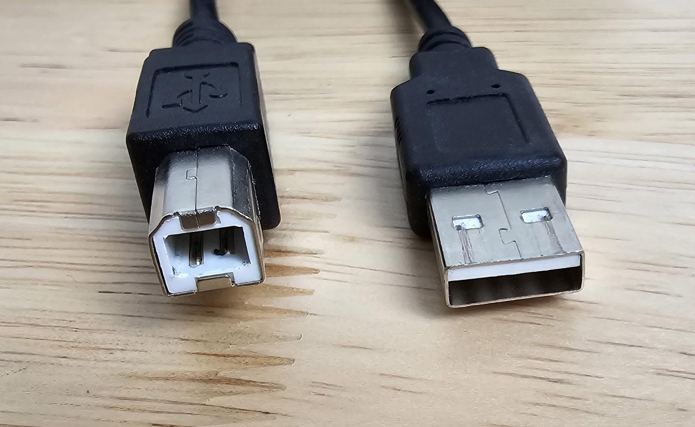

# 7P notes: Wacom Cintiq 22 (DTK-2260)

## Overview

As of July 2024, Although released in 2019 the Wacom Cintiq 22 continues to deliver the best drawing experience possible with a slightly out-of-date screen.

I bought mine used from eBay for $380 and was very satisfied.&#x20;

## Basics

Release year: 2019

User manual: [https://101.wacom.com/UserHelp/en/TOC/DTK-2260.html](https://101.wacom.com/UserHelp/en/TOC/DTK-2260.html)

## General

**Pen** - comes with the Wacom Pro Pen 2. Which is an excellent pen and responsible for much of the great drawing experience. See [my notes on the pro pen 2](../wacom-pen-models/7p-notes-wacom-kp-504e.md).

**Pressure handling** - EXCELLENT. See my notes on the Pro Pen 2.

## Display > basics

**Size:** 21.5 in (55 cm)

**Lamination** - NO. This is not a laminated display. Yes this introduces a very slight increase in parallax but not much. And it did not affect my drawing.

**Refresh Rate** - Standard. up to 60 Hz.

**Resolution** - 1920x1080

**Brightness**: 210 nits specified. Like many pen displays, this is not a super bright display - which is fine because most people tend to keep their eyes closer to the screen than a normal monitor and if the display was brighter, it might be overwhelming.

**Can you see pixels?** YES clearly. Which is to be expected with this resolution at this size.

**Bit depth**: 8bits per channel

**AG film:** YES

**Etched glass:** NO

**Response time (G2G):** 22ms. This response time is fine for drawing and office work. Serious gamers will likely not want to use this for a gaming monitor.

**Color gamut:**

* 72% NTSC
* 96% sRGB&#x20;
* The colors look fine. This is not a modern wide-gamut display so you might find it looks less saturated than other modern displays. But I think it looks fine and works well for my needs. I prefer to work in sRGB anyway.

## **Pen tracking**

**Accuracy:** EXCELLENT in center an in edges and corners. very small deviation in corners and edges and better than many other tablets I have seen.

**Tilt compensation** - EXCELLENT. Tilting pen in its full supported range did not move the pointer from the tip by an appreciable amount.&#x20;

## **Pointer lag**

TYPICAL. Lag is visible but this amount is what we see in all pen displays.

## **Diagonal wobble**

MINOR WOBBLE. Good for a pen display.

<figure><figcaption></figcaption></figure>

## **Anti-glare sparkle**&#x20;

VERY GOOD. Very faint ag sparkle visible. Only visible if eyes are 4" to 6" from tablet.&#x20;

## **Display sharpness**&#x20;

pixels are clearly visible and well delineated

## Blacklight bleed

I think this did have a little more blacklight bleed than other pen displays. I'm not particularly sensitive to backlight bleed and it didn't affect me at all.

## **Express keys**

&#x20;Tablet has no express keys

## **VESA mounting**

YES. This tablet supports VESA mounting (100mmx100mm)

I did not test with any VESA arm or stand.

## **Stand**

I think the original packaging includes a stand but the used package I bought on eBay did not come with a stand.

## **Legs**

Does not have an legs.

## Surface Texture

Typical texture of a plastic film on glass. Film provides enough grip. Pen does not "slide" around.&#x20;

Feels ever so slightly "stickier" than an etched glass display.&#x20;

## Fans

I can't find a reference about it having fans or not. I put my ear right on top of the the vents at top an could hear nothing.

## Noise

Silent (as far as I could tell). if there is a noise it is very faint and not something I can hear.

## Touch

NO. This tablet does NOT support touch.

## Heat

I ran the display at 100% brightness for two hours. The overall tablet is about room temperature with a very slight (very slight) warms to wards the left side.&#x20;

## Device shape

It has a wedge shape. It is thicker at the top of the screen and thinner at the bottom of the screen. So laying it on a desk surface gives it a very slight angle of maybe 10 degrees. It's nice to have some angle but typically if drawing at an angle is important for you, then get a stand.&#x20;

## Sound support

* No speakers
* No headphone jack

## **Cables and Connectivity**

**Ports**

* Power
* USB-B&#x20;
* HDMI

**Special note on USB-B**

This port type is getting less common. So to make sure you know what the cable looks like here is a photo of the cable I used. I used my own cable, the original Wacom cable was part of the package I bought from eBay. USB-B is on the left. USB-A is on the right.

<figure><figcaption></figcaption></figure>

**Special note on HDMI**

In 2024, HDMI ports on laptops is getting rare. So you may need to get a USB-C to HDMI adapter for you USB-C port that supports DP alt mode. In my experience sometimes these adapters are "finicky". So be aware. More here: [**Using HDMI adapters with pen displays**](../../../guides/pen-displays/using-hdmi-adapters-with-pen-displays.md)

## Other notes

If you are going to buy this tablet used to save some money, please keep in mind that the Pro Pen 2 is not cheap. If you lose or break the pen,  getting a new one is about $90.

