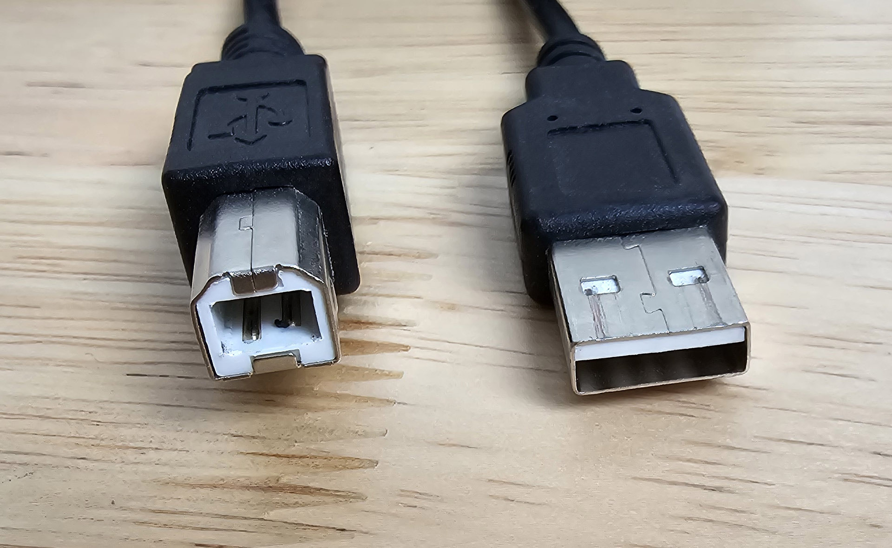

# Wacom Cintiq 22 (DTK-2260)

## Overview

As of July 2024, Although released in 2019 the Wacom Cintiq 22 continues to deliver the best drawing experience possible with a slightly out-of-date screen.

I bought mine used from eBay for $380 and was very satisfied.&#x20;

## Basics

Release year: 2019

User manual: [https://101.wacom.com/UserHelp/en/TOC/DTK-2260.html](https://101.wacom.com/UserHelp/en/TOC/DTK-2260.html)

## General

**Pen** - comes with the Wacom Pro Pen 2. Which is an excellent pen and responsible for much of the great drawing experience. See [my notes on the pro pen 2](../wacom-pen-models/7p-notes-wacom-kp-504e.md).

**Pressure handling** - EXCELLENT. see my notes on the Pro Pen 2.

**Tilt compensation** - EXCELLENT. Tilting pen in its full supported range did not move the pointer from the tip by an appreciable amount.&#x20;

## Display > basics

**Size:** 21.5 in (55 cm)

**Lamination** - NO. This is not a laminated display. Yes this introduces a very slight increase in parallax but not much. And it did not affect my drawing.

**Refresh Rate** - Standard. up to 60 Hz.

**Resolution** - 1920x1080

**Sharpness** - pixels are clearly visible and well delineated

**Anti-glare sparkle** - very faint. Only visible if eyes are 4" to 6" from tablet.&#x20;

**Brightness**: 210 nits specified. Like many pen displays, this is not a super bright display - which is fine because most people tend to keep their eyes closer to the screen than a normal monitor and if the display was brighter, it might be overwhelming.

**Can you see pixels?** YES clearly. Which is to be expected with this resolution at this size.

**Bit depth**: 8bits per channel

**AG film:** YES

**Etched glass:** NO

**Response time (G2G):** 22ms. This response time is fine for drawing and office work. Serious gamers will likely not want to use this for a gaming monitor.

## **Cables and Connectivity**

**Ports**

* Power
* USB-B&#x20;
* HDMI

**Special note on USB-B**

This port type is getting less common. So to make sure you know what the cable looks like here is a photo of the cable I used. I used my own cable, the original Wacom cable was part of the package I bought from eBay. USB-B is on the left. USB-A is on the right.

<figure><figcaption></figcaption></figure>

## Notes

If you are going to buy this tablet used to save some money, please keep in mind that the Pro Pen 2 is not cheap. If you lose or break the pen,  getting a new one is about $90.

