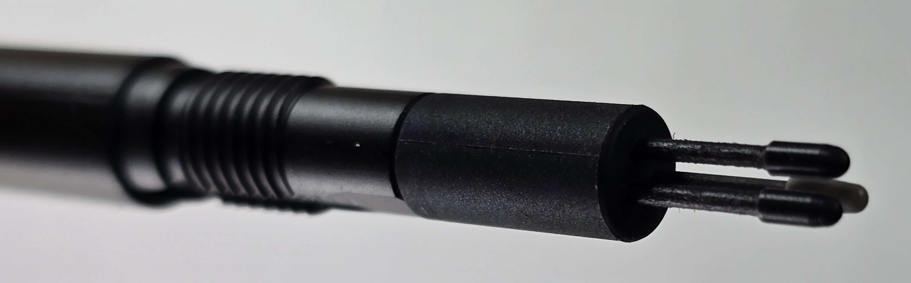

# 7P notes: Wacom Movink 13 (DTH-135)


<mark style="color:red;">**I am currently evaluating this product. So these notes are IN PROGRESS.**</mark>


## Basics

* Product page: [https://www.wacom.com/en-us/products/pen-displays/wacom-movink](https://www.wacom.com/en-us/products/pen-displays/wacom-movink)
* User manual: [https://101.wacom.com/UserHelp/en/TOC/DTH135TOC.html](https://101.wacom.com/UserHelp/en/TOC/DTH135TOC.html)

## Pen

Comes with a special version of the Wacom Pro Pen 3. More here [**Wacom Pro Pen 3**](../wacom-pens/7p-notes-wacom-acp50000dz.md).

This variant of the Wacom Pro Pen 3 is exactly the same as the normal pro pen in terms of pressure response, IAF, max pressure.

But there are a few differences.

First, the standard Wacom Pro Pen 3 comes with a metal rod you can use to change the weight and weight distribution of the pen. This variant does not have that rod.

Instead inside the pen, there is storage for 3 nibs.

<figure><figcaption></figcaption></figure>

Also this variant pen does not come with any grips or any button strips.

## Pen compatibility

* Pens listed as compatible by Wacom
  * Wacom Pro Pen 3 - I tested this. It works.
  * Wacom Pro Pen 2 - I tested this. It works.
* Pens not specifically listed as compatible by Wacom
  * Wacom One GEN1 pen (CP-913) - I tested. It works.
  * Wacom One GEN2 pen (CP-923) - I tested. It works.
  * Samsung S pen (that comes with Galaxy Tab series) - I tested. It works.
  * Samsung S pen (that comes with Samsung S24 Ultra phone) - I tested. It works.

## Difference in pressure handling between pro pens and non pro pens

At the low end of pressure, there is a difference with how pressure is handled between the pro pens and other pens. With the pro pens - the lines are low pressure change in pressure simply due to my hand. And the strokes below are what I would expect. Don't let the appearance deceive you, they are good. The pen is responsing to my inputs as expected.

<figure><figcaption>
Movink 13 + Wacom Pro Pen 3 + Krtia brush at 100px
</figcaption></figure>

<figure><figcaption>
Movink 13 + Wacom Pro Pen 3 + Krtia brush at 300px
</figcaption></figure>

Now see what happened with the Samsung S Pen creator edition. This also happened with the other consumer pens such as the Wacom CP-913, Wacom CP-923 and the other Samsung S pens I tried.

Notice the "pulsing".&#x20;

<figure><figcaption>
Movink 13 + Samsung S pen creator edition + Krtia brush at 100px
</figcaption></figure>

The Wacom One GEN2 pen (CP-923) also exhibits some of this pulsing

<figure><figcaption>
Movink 13 + Wacom CP-923 + Krita brush at 200px
</figcaption></figure>

The same pulsing is evident with the Wacom One GEN1 pen (CP-913)

<figure><figcaption>
Movink 13 + Wacom CP-913 + Krita brush at 200px
</figcaption></figure>

## Core specs

* Pen tech: EMR
* Active Area diagonal: 13.3"
* Pen pressure levels: 8192
* Tilt: YES. 60 degrees
* Resolution: 5080 LPI (200 LPMM)
* Report rate: Wacom does not specify
* Max hover height: Wacom does not specify

## Display specs

* Display panel type: OLED
* Panel bit depth: 10bit
* Display resolution: 1920x1080 (HD)
* Aspect Ratio: 16x9
* Display size : 13.3"
* Refresh rate max: 60Hz
* Surface: Anti-glare glass (presumably means etched glass)
  * They also say it has Anti-fingerprint coating
* Response time: 0.2ms
* Contrast ratio: 100000:1

## Display color modes

In the OSD you can alter the color modes.

* Native
* AdobeRGB
* DCI-P3
* Rec.709
* Rec.2020
* Display P3
* sRGB
* EBU
* Custom

Out of the box, the color mode is set to Native. I use it with the sRGB color mode.

## Display OSD

The button on the right side of the tablet when tapped brings up the OSD.

You can use touch to work with the OSD. This works even if you have disabled touch for use with the tablet. That is a nice touch!

These 4 OSD options lead to sub menus: Input Source, Display settings, Tablet buttons, Other settings.

These 2 OSD buttons toggle on/off: Display saving, Touch on/off&#x20;

<figure><figcaption></figcaption></figure>

<figure><figcaption></figcaption></figure>

<figure><figcaption></figcaption></figure>

<figure><figcaption></figcaption></figure>

<figure><figcaption></figcaption></figure>

## Brightness

Wacom lists the max brightness at 350 nits.

Out of the box the brightness is set to 50%.

I use it at 50%.

100% is bright but clearly not as bright as my Surface Pro 8 at 100% (450 nits) or as bright as the Samsung Galaxy 8 Ultra at 100% (420 nits)

## Heat

At 50% brightness and left running for a few hours the tablet felt cool to the touch.

## OLED longevity

To early to say.

## Pointer lag

Still obvious pointer lag, but notably less than many pen displays.

Still not close the the very minimal pointer lag of an Apple iPad with the Apple Pencil 2.

## Parallax

Very good. Probably better than the Cintiq Pro tablets.

Not quite as good as an iPad.

## Display color fringing

The display exhibits some subtle color fringing. I can notice this when your eyes are close to the display - maybe up 6" to 8" away - and I have to be looking for it.

If you draw a black disc on a white background, the fringing manifests as about a 1 pixel width change in color at the edge of the disk. From the top and the left the color is shifted slightly towards green. From the bottom and the right the color is shifted toward magenta.

This gives the appearance of slight "chromatic aberration" effect.

I suspect this is a result of the OLED panel and normal.

I notice the same thing int the OLED panel of my Smasung Galaxy Tab S8 Ultra. Though in the Samsung tablet the effect seems a bit less. Maybe that is due to the higher resolution of the display panel in my Samsung device.

## Display sharpness

Pixels on the display are sharp and well-delineated.

## Surface texture

* Feels about the same as a recent-model Cintiq Pro (22, 27)
* Definitely not slippery like an normal glass iPad surface.

## Pen tilt

Typical. nothing out of the ordinary.

Pen tilt compensation - GOOD. Changing the tilt of the pen did not significantly change the location of the pointer.

## Pen tracking accuracy

Typical. Very accurate across entire display. slight inaccuracy (maybe 2mm) at the very edges of the display.&#x20;

## Diagonal wobble

<mark style="color:red;">**TO BE EVALUATED**</mark>

## Active Area

* 11.6in x 6.5in = 13.3in diagonal
* 294mm x 165mm = 337mm diagonal

## Weight

It weights 420g. This an exceptionally low weight.&#x20;

420g is less than these pen displays

* Wacom One Gen (DTC-133) 1000g
* Wacom One 12 (DTC- 121) 700g
* Wacom one 13 touch (DTH-134) 900g

It weighs less than any of the these Intuos Pro pen tablets:

* Intuos Pro Small (PTH-460) -> 450g
* Intuos Pro Medium (PTH-660) -> 700g
* Intuos Pro Large (PTH-860) -> 1300g

## Thickness

* Is very thin at 6.6mm.
* It is thinner than the Wacom One pen displays which are 14.6mm
* It is even thinner than some pen tablets.&#x20;
  * the Intuos Pro tablets (PTH-x60) are between 8mm and 8.45mm thick.
  * The One by Wacom pen tablets (CTL-471, CTL-672) are 8.7mm think.

## Touch support

Yes

* Windows - Works well on Windows
* Mac OS - did not test

## Connectivity and Cabling

* 2 USB-C ports
  * One on left side
  * One on right side
  * Either port can be used to connect to the computer
* Wireless support: NO (typical for pen displays)
* Cable comes with tablet; YES a 1m USB-C cable comes with the box
* Can be used with other USB-C cables. Not mentioned explicitly by wacom.

### Connection options

* A single USB-C cable that supplies power, data, and display signal
* Two USB-C cables. One that that provides data and display signal and one that supports power.
* A 3-in-1 cable.&#x20;
  * I tested the 3 in 1 (HDMI) Cable for 2023 Edition Wacom One Displays (ACK4490602Z) with the Movink 13. It worked correctly
  * You can buy it from the Wacom store: [https://estore.wacom.com/en-us/wacom-one-3-in-1-cable-ack4490602z.html](https://estore.wacom.com/en-us/wacom-one-3-in-1-cable-ack4490602z.html)
* Some people have bought a Wacom 3-in-1 cable (not sure which model) which lets them connect the Movink to the HDMI of their computer.&#x20;
  * See: [https://www.reddit.com/r/wacom/comments/1d16v5d/psa\_the\_new\_movink\_only\_work\_on\_thunderbolt\_usb4/](https://www.reddit.com/r/wacom/comments/1d16v5d/psa\_the\_new\_movink\_only\_work\_on\_thunderbolt\_usb4/)

## Buttons

There are two side buttons. One on top left side and one on top right side. There is some ability to configure the behaviors of the buttons.

## Dead Pixels

none observed.

## Blacks

Very deep blacks as expected due to OLED.&#x20;

## Ergonomics

**VESA mounting** - This tablet does NOT have VESA mounting holes.

**Legs** - This tablet does NOT have legs

**Built in Stand** - This tablet does not have a built in stand

**Comes with stand** - No must be purchased separately

## Audio

* No headphone jack
* No built-in speakers

## Fans and Fan noise

No fans. No fan noise.

## Noise

Completely quiet. No noise at all.

## Using it as a pen tablet&#x20;

This means can we turn off the screen and use it like a pen tablet like an Intuos Pro.

There isn't DIRECT support for this feature unlike some pen tablets, but you can tell your OS to stop sending a signal to the tablet and it will behave like a pen tablet once the screen turns off.

## Using it with a Chromebook

In my testing, the pen does not work when used with ChromeOS.

The tablet functioned only like a touch-enabled external display.

## Using it with an Android device

I connected my Samsung Galaxy Tab S8 Ultra to a Microsoft Surface Thunberbolt dock. Then I connected the dock to the Movink 13 using a Thunderbolt 3 cable.

* I was able to draw with pressure sensitivity and tilt.
* I had no way to configure the actions of the pen buttons. And clicking on them did nothing that I observed.

## Accessories

* Wacom Foldable stand&#x20;
* Wacom Movink Tablet Sleeve
* Wacom Converter for HDMI
