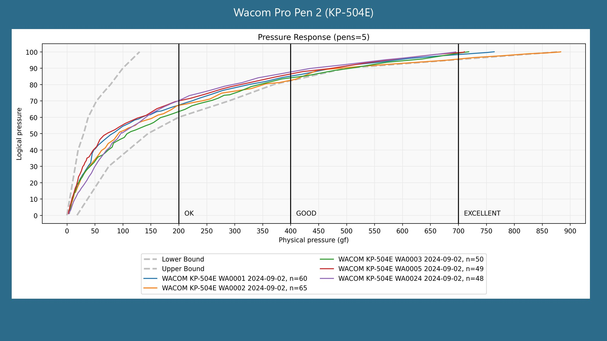

# 7P notes: Pro Pen 2 (KP-504E)

## Overview

The Wacom Pro Pen 2 is an INCREDIBLE pen. Despite the existence of the Pro Pen 3, I think the Pro Pen 2 is better. This is the standard against which I judge all other pens.

<figure><figcaption></figcaption></figure>

## Cost

Take care of your Pro Pen 2. A replacement typically costs $90 US. &#x20;

## Pressure > Levels

* It supports 8192 levels of pressure

## Pressure > Initial Activation Force

* Like other Wacom pro pens it has an very low IAF of <1gf as measured my Kuuube

## Pressure Range > Maximum Pressure

The pressure response is remarkably consistent across multiple units tested. The maximum pressure ranges from about 700gf to 800 gf.

<figure><figcaption></figcaption></figure>

## Features

* Two buttons
* Eraser&#x20;
