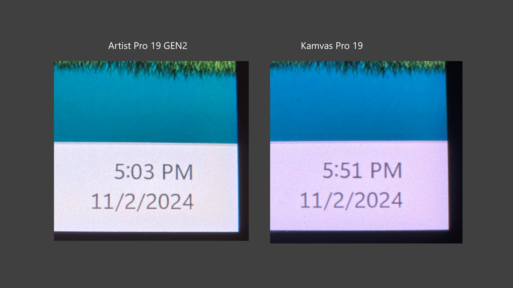
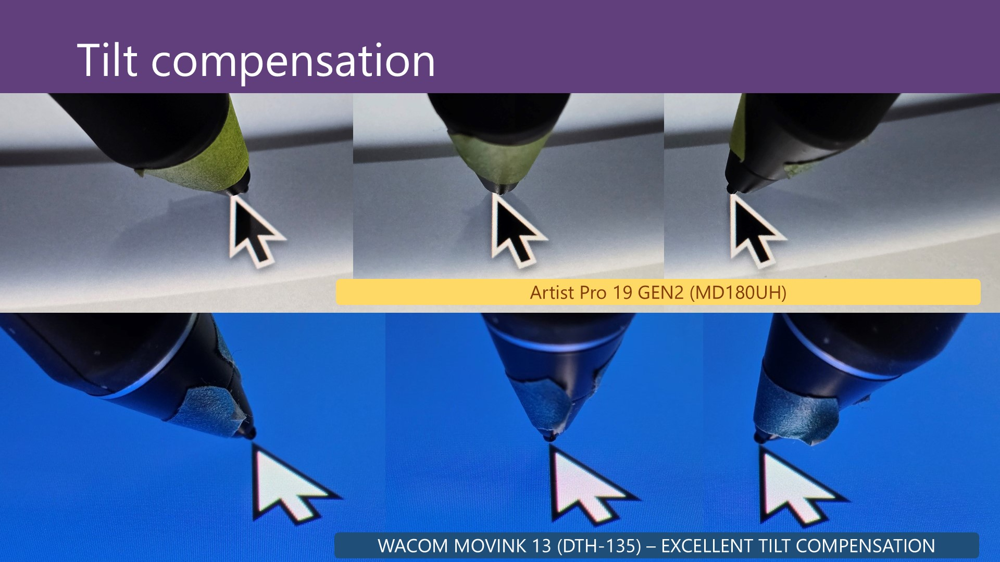
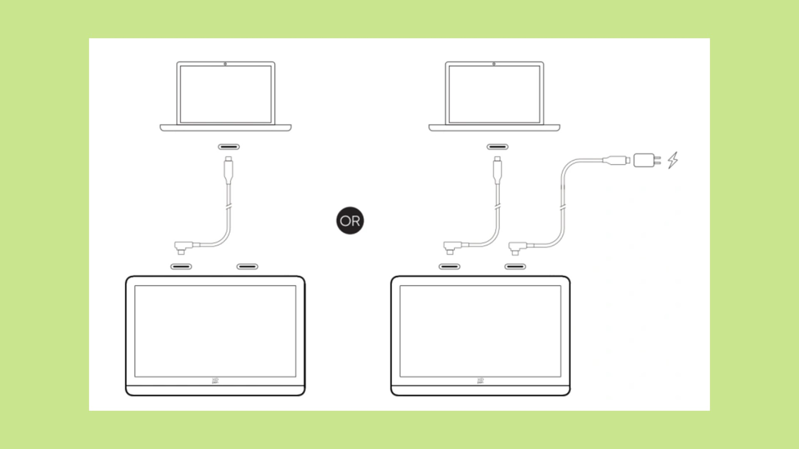

# 7P notes: XP-Pen Artist Pro 19 GEN2 (MD180UH)

## Basics

* Released: 2024
* Product page: [https://www.xp-pen.com/product/artist-pro-19-gen-2.html](https://www.xp-pen.com/product/artist-pro-19-gen-2.html)

## Core specs

* Active Area:&#x20;
  * 9.06” x 16.1" -> 18.47" diagonal
  * 409 x 230mm -> 469.2mm diagonal&#x20;
* Aspect Ratio: 16x9&#x20;
* NOTE: it has the exact same size Active Area as the Huion Kamvas Pro 19.

## Display specs

* Display panel tech: IPS&#x20;
* Resolution: 3840 x 2160&#x20;
* Aspect Ratio: 16:9
* Lamination: YES
* Viewing Angle: 178°
* Contrast: unspecified
* Response time: unspecified
* Refresh rate: 60hz
* Brightness: 250 cd/m2
* Anti-glare treatment:
* Etched glass Color: 10 bit (8bit+FRC)
* Color Gamut Coverage Ratio: 99.8% sRGB, 96% Adobe RGB, 98% Display P3

## Pens

The tablet comes with two pens

* X3 Pro Roller Stylus
* X3 Pro Slim Stylus

See [**my notes on the XP-Pen X3 Pro series of pens**](../xp-pen-pens/7p-notes-xp-pen-x3-pro-pens.md).&#x20;

## Compatible pens

It is compatible with other pens in the X3 pro series.

* X3 Pro Roller Stylus
* X3 Pro Slim Stylus
* X3 Pro - I tested this. It worked.

## Pen pressure

XP-Pen states these numbers for X3 Pro pens

* IAF: 3gf
* Max Pressure: 400gf

In my testing with the pens that came with the tablet

* Subjectively, 3gf seemed about right
* I measured the max pressure at around 250gf.&#x20;

## Anti-glare sparkle

* RATING: VERY GOOD. Low amounts of AG sparkle.&#x20;
* Maybe just slightly more than the Cintiq Pro 22.
* Similar to Huion Kamvas Pro 19

## Sharpness

Pixels are relatively clear and well delineated.

The look is clearly sharper than the Huion Kamvas Pro 19 which has a soft look that some people don't like.

<figure><figcaption></figcaption></figure>

## Design

* Really does look like a larger version of the XP-Pen Artist Pro 16 GEN2&#x20;

## Pressure transition

Moving between low and high pressure cave smooth pressure transitions.&#x20;

## Accuracy

XP-Pen states:

* Center:  ±0.4 mm&#x20;
* Corner: ±0.8 mm&#x20;

RATING: VERY GOOD.

My experience matched the accuracy numbers XP-Pen provides.

## Parallax

VERY GOOD.

On par with Cintiq Pro 22 and with Huion Kamvas Pro 19.

## Tilt compensation

OK. Minor displacement at 45deg

* Pen tilted left -> 1.8 mm displacement
* Pen vertical -> \~1 mm displacement
* Pen tilted right -> \~0 mm displacement

<figure><figcaption></figcaption></figure>

## Pressure scan rate testing

RATING: VERY GOOD

Drawing 50 strokes as fast possible results in no lost strokes.

## Diagonal wobble

Rating: GOOD low amounts of diagonal wobble.&#x20;

* Just a little more than the Huion Kamvas Pro 19 &#x20;
* About the same as the Cintiq Pro 22
* A little less than the XP-Pen Artist Pro 16 GEN2
* About the same as the Huion Kamvas 13 GEN3
* About the same as the XP-Pen Artist 22 Plus

<figure><figcaption></figcaption></figure>

## Surface texture

As is typical for etched glass surfaces, there is a slight surface texture.

Using the same X3 Pro pen with a plastic nib&#x20;

The XP-Pen Artist Pro 19 GEN2 has an amount of surface texture that is

* about the same as the XP-Pen Artist Pro 19 GEN2&#x20;
* about the same as the Huion Kamvas Pro 19
* a little less than the XP-Pen Artist 22 Plus
* a little less than the Cintiq Pro 22

## Connections and cabling

### Ports

* 2 USB-C ports on the top edge
  * The ports are NOT recessed

### How I connected it

I tested both the configurations below with my M3 Macbook Pro and a Surface Pro 8

<figure><figcaption></figcaption></figure>

## VESA

YES. this tablet is VESA mountable (75mm x 75mm)

## Legs

YES. This tablet has a two folding legs on the back.

## Stand

This tablet does NOT come with a stand.

I used the stand that came with the Xencelabs Pen Display 16 to hold this tablet. It worked very well.

## Touch

This tablet does NOT support touch.

## Audio

There are no audio features such as a headphone jack.

## Heat

GOOD. Tablet keeps cool&#x20;

* Left 1/3 cool
* Right 2/3 slightly warm
* Warmer near the USB-C ports

