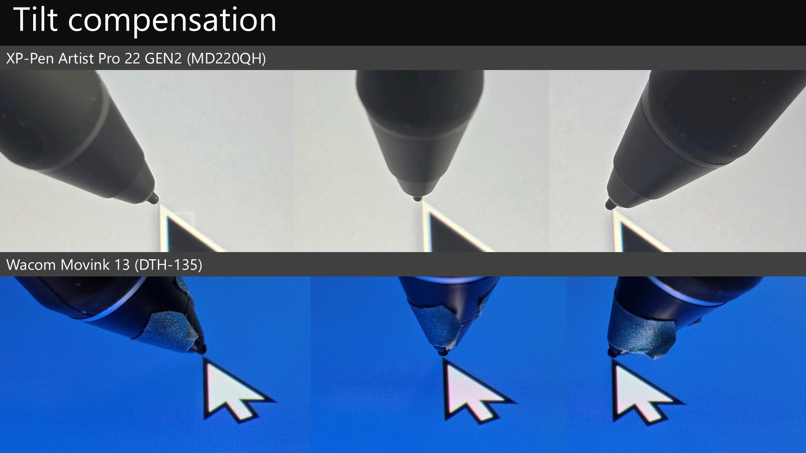

# 7P notes: XP-Pen Artist Pro 22 GEN2 (MD220QH)

## Basics

* Release year: 2025
* Product page: [https://www.xp-pen.com/product/artist-pro-22-gen-2.html](https://www.xp-pen.com/product/artist-pro-22-gen-2.html)&#x20;

## Core specs

* Active Area:&#x20;
  * 18.716” x 10.528" -> 21.474" diagonal
  * 475.392 mm x 267.408 mm -> 545.4mm diagonal&#x20;
* Aspect Ratio: 16x9 .

## Display specs

* Display panel tech: IPS&#x20;
* Resolution: 2560 x 1440&#x20;
* Aspect Ratio: 16:9
* Lamination: YES
* Viewing Angle: 178°
* Contrast: unspecified
* Response time: unspecified
* Refresh rate: 60hz
* Brightness: 250 cd/m2
* Anti-glare treatment: Etched glass&#x20;
* Color: 8 bit
* Color Gamut Coverage Ratio: 99% sRGB, 99% Adobe RGB, 94% Display P3

## Included Pen

The tablet comes with a single pen: X3 Pro Stylus. See [**my notes on the XP-Pen X3 Pro series of pens**](../xp-pen-pens/7p-notes-xp-pen-x3-pro-pens.md).&#x20;

## Compatible pens

It is compatible with other pens in the X3 pro series.

* X3 Pro Roller Stylus
* X3 Pro Slim Stylus
* X3 Pro

## Pen pressure

XP-Pen states these numbers for X3 Pro pens

* IAF: 3gf
* Max Pressure: 400gf

In my testing with the pens that came with the tablet

* Subjectively, 3gf seemed about right
* Max pressure: Still to be tested on the included pen

See [**my notes on the XP-Pen X3 Pro series of pens**](../xp-pen-pens/7p-notes-xp-pen-x3-pro-pens.md).&#x20;

## Anti-glare sparkle

* RATING: VERY GOOD. Low amounts of AG sparkle.&#x20;
* Maybe just slightly more than the Cintiq Pro 22.
* Similar to Huion Kamvas Pro 19

## <mark style="color:red;">Sharpness</mark>

<mark style="color:red;">Still needs testing</mark>

## Design

Looks exactly like the XP-Pen Artist 22 Plus.

## Pressure transition

Moving between low and high pressure cave smooth pressure transitions.&#x20;

## Accuracy

XP-Pen states:

* Center:  ±0.4 mm&#x20;
* Corner: NOT STATED

RATING: VERY GOOD.

My experience matched the accuracy numbers XP-Pen provides for center accuracy.  Corner accuracy was typical for a pen display - a slight inaccuracy of 1 or 2 mm.

## Parallax

VERY GOOD.

On par with Cintiq Pro 22 and with Huion Kamvas Pro 19.

## Tilt compensation

EXCELLENT - I didn't see the pointer shift much at all as I tilted in different directions

<figure><figcaption></figcaption></figure>

## Pressure scan rate testing

RATING: VERY GOOD

Drawing 50 strokes as fast possible results in no lost strokes.

## Diagonal wobble

Rating: VERY GOOD  - very low amounts of diagonal wobble.&#x20;

On par with the Huion Kamvas Pro 19  and the Wacom Cintiq Pro 22

