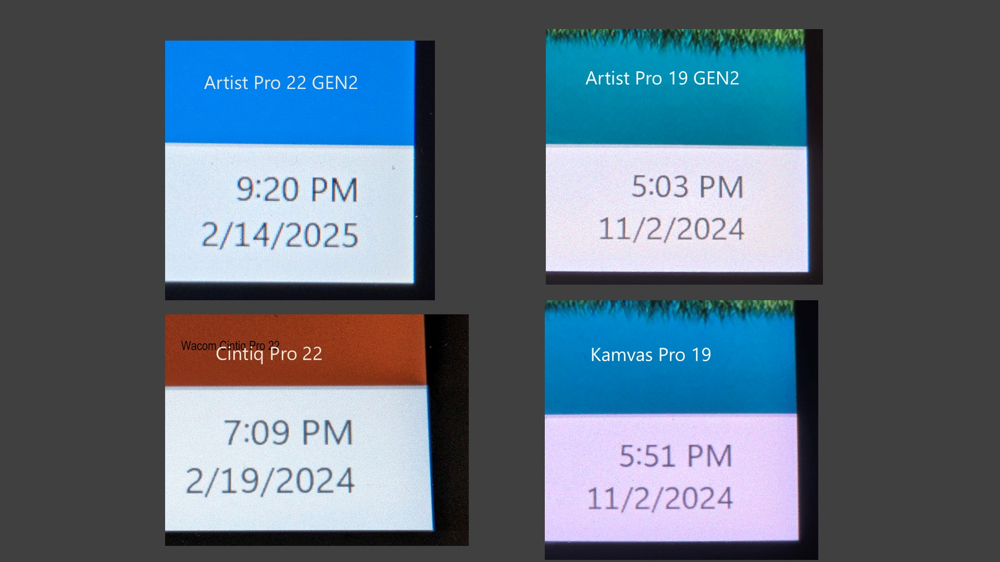

# 7P: XP-Pen Artist Pro 22 GEN2 (MD220QH)

## Summary

* As of April 2025, of XP-Pen's Artist Pro GEN2 line of pen displays, this is my favorite one.&#x20;
* As of April 2025, of non-Wacom 22" pen display this is my favorite one.
* I found the drawing performance to very good
* This is a nice setup up in terms of size over the Artist Pro 16 GEN2 and the Artist Pro 19 GEN2 in terms of size without getting too large. (In general 22" size is my favorite)

## Basics

* Release year: 2025
* Product page: [https://www.xp-pen.com/product/artist-pro-22-gen-2.html](https://www.xp-pen.com/product/artist-pro-22-gen-2.html)&#x20;
* User manual [https://www.xp-pen.com/user-manual/artist-pro-22-gen-2.html](https://www.xp-pen.com/user-manual/artist-pro-22-gen-2.html)

## Photos

<figure><figcaption></figcaption></figure>

<figure><figcaption></figcaption></figure>

## Core specs

* Active Area:&#x20;
  * 18.716” x 10.528" -> 21.474" diagonal
  * 475.392 mm x 267.408 mm -> 545.4mm diagonal&#x20;
* Aspect Ratio: 16x9&#x20;
* Accuracy: ±0.4 mm (center)
* Report rate: 220Hz

## Display specs

* Display panel tech: IPS&#x20;
* Resolution: 2560 x 1440&#x20;
* Aspect Ratio: 16:9
* Lamination: YES
* Viewing Angle: 178°
* Contrast: unspecified
* Response time: unspecified
* Refresh rate: 60hz
* Brightness: 250 cd/m2
* Anti-glare treatment: Etched glass&#x20;
* Color: 8 bit
* Color Gamut Coverage Ratio: 99% sRGB, 99% Adobe RGB, 94% Display P3

## Included Pen

* The tablet comes with a single pen: X3 Pro Stylus.&#x20;
* See [**my notes on the XP-Pen X3 Pro series of pens**](../xp-pen-pens/7p-xppen-x3pro-pen.md).&#x20;

## Compatible pens

It is compatible with other pens in the X3 pro series.

* X3 Pro Roller Stylus
* X3 Pro Slim Stylus
* X3 Pro

## Anti-glare sparkle

* RATING: VERY GOOD. Low amounts of AG sparkle.&#x20;
* Maybe just slightly more than the Cintiq Pro 22.
* Similar amount of AG sparkle to Huion Kamvas Pro 19

## Sharpness

Photos may not capture it, but the display is slightly "soft" like what I saw in the Kamvas Pro 19. The Artist Pro19 GEN2 and Cintiq Pro 22 are a bit sharper. It is NOT blurry just a little softer. This is likely due to the anti-glare treatment.

<figure><figcaption></figcaption></figure>

## Design

Looks exactly like the XP-Pen Artist 22 Plus. So very attractive overall design.

## Pressure transition

Moving between low and high pressure gave smooth pressure transitions.&#x20;

## Accuracy

XP-Pen states:

* Center:  ±0.4 mm&#x20;
* Corner: NOT STATED

RATING: VERY GOOD.

My experience matched the accuracy numbers XP-Pen provides for center accuracy.  Corner accuracy was typical for a pen display - a slight inaccuracy of 1 or 2 mm.

## Parallax

VERY GOOD.

On par with Cintiq Pro 22 and with Huion Kamvas Pro 19.

## Tilt compensation

EXCELLENT - I didn't see the pointer shift much at all as I tilted in different directions

<figure><figcaption></figcaption></figure>

## Pressure scan rate testing

* RATING: VERY GOOD
* Drawing 50 strokes as fast possible results in no lost strokes.

## Diagonal wobble

* Rating: VERY GOOD  - very low amounts of diagonal wobble.&#x20;
* On par with the Huion Kamvas Pro 19  and the Wacom Cintiq Pro 22

<figure><figcaption></figcaption></figure>

## Ports

<figure><figcaption></figcaption></figure>

## Connections and cabling

It can be connected with USB-C cable to your computer, This USB-C cable should be either the full-featured USB-C cable that came with the tablet or you can use a Thunderbolt 3 or Thunderbolt 4 cable.

<figure><figcaption></figcaption></figure>

You can also connect it with HDMI and USB if needed

<figure><figcaption></figcaption></figure>

**3-in-1 cable** - This tablet does not use or come with a 3-in-1 cable. And you shouldn't need a 3-in-1 cable anyway.

## Stand

* Comes with a very nice stand.
* The stand is pre-attached in the box.

## Heat

* Cool with warm regions toward the middle and the top near the ports

## Noise

* Silent
