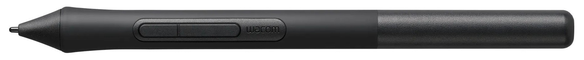
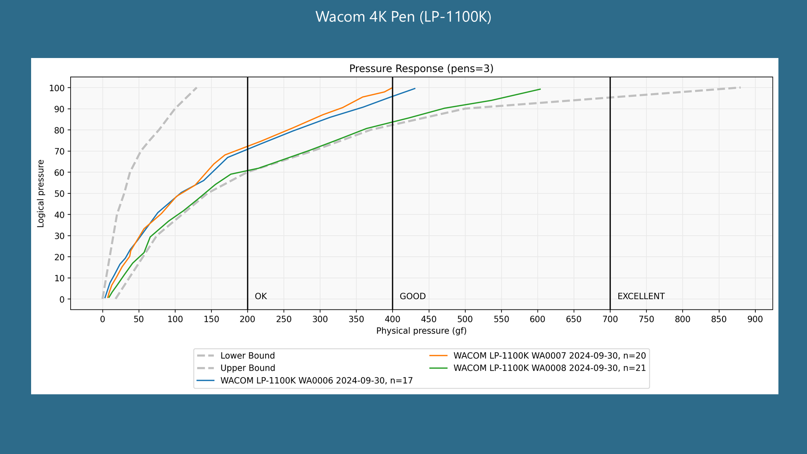

# 7P: Wacom 4K Pen for Intuos (LP-1100K)

The Wacom LP-1100K pen is a very good Wacom consumer pen.

<figure><figcaption></figcaption></figure>

It comes with and is ONLY compatible with these tablets released in 2018.

<table><thead><tr><th width="131">Model number</th><th width="280">Model name</th></tr></thead><tbody><tr><td>CTL-6100</td><td>Intuos Medium</td></tr><tr><td>CTL-6100WL</td><td>Intuos Medium Bluetooth</td></tr><tr><td>CTL-4100</td><td>Intuos Small</td></tr><tr><td>CTL-4100WL</td><td>Intuos Small Bluettooth</td></tr></tbody></table>

## Initial Activation Force

Tablet expert Kuuube has measure the IAF of the LP-1100K as <= 1gf.

## Pressure response and maximum pressure

<figure><figcaption></figcaption></figure>

In my measurements the maximum pressure of these pens varies from 400 to 600gf. Although that is a wide range. The minimum value is about 400gf which is a very good maximum pressure.

## Special features

The bottom part of the pen screws off. Inside is a holder for 3 nibs.
