# 7P: Wacom Intuos Pro 2025 (PTK-x70)

ummary

This is an EXCELLENT tablet, but may not be the right one for you if:

* You do not like the new ExpressKeys placement
* The lack of multi-touch support
* You are already happy with an Intuos Pro 2017 model

## Companion video

If you would rather watch:  [https://www.youtube.com/watch?v=Q2rH32pBpq0](https://www.youtube.com/watch?v=Q2rH32pBpq0)

But do check this document for any updates since the original video was published.



## Connections and ports

## Changes to key features from 2017 edition

* No improvement to drawing performance
* ExpressKeys and dials moved to the top
* Multitouch support dropped
* Bezels are significantly smaller
* Comes with Pro Pen 3 instead of Pro Pen 2

## Important Quality-of-life improvements

* Size & weight
* 16x9 aspect ratio
* Larger native active area
* Big increase in active area when using Force Proportions on 16:9 monitors
* Pen compatibility
* Pro Pen 3 is very customizable
* Wireless connectivity

## Should you buy the Intuos Pro 2025

* Your first pro tablet? → YES
* Want the best? → YES
* Upgrade from 2017 edition? → MAYBE
* Need multitouch support? → NO

## Should you buy the Intuos Pro 2017 or the Intuos Pro 2025

Complex topic. Will address in May 2025.

## Historical context

From 2009 to 2025, there have been 4 editions of profesional pen tablets from Wacom and all have maintain a consistent layout with expresskeys on the left. Therefore the new layout of this tablet was quite surprising for many of us.

<figure>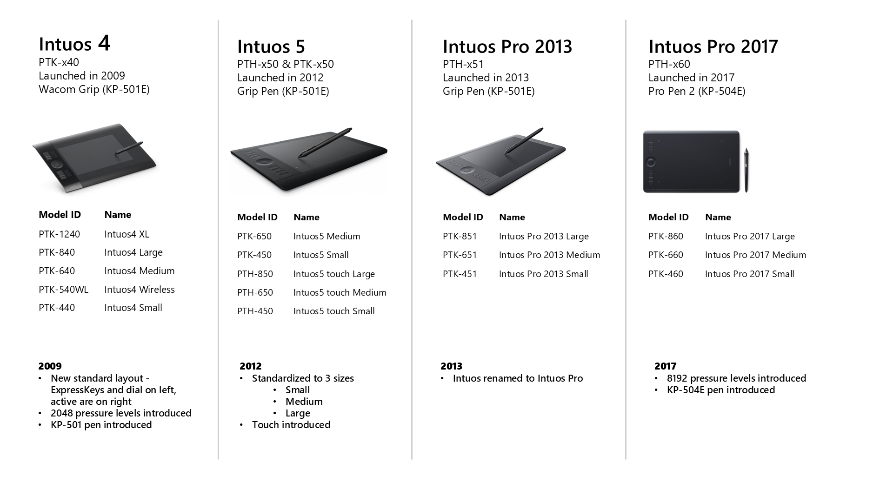<figcaption></figcaption></figure>

## Model numbers

It's always helpful to be clear on the model numbers so that you don't buy the wrong version of the tablet.

<figure><figcaption></figcaption></figure>

## Design

Although not everyone shares this opinion, I find it a very beautiful and professional-looking tablet.

<figure>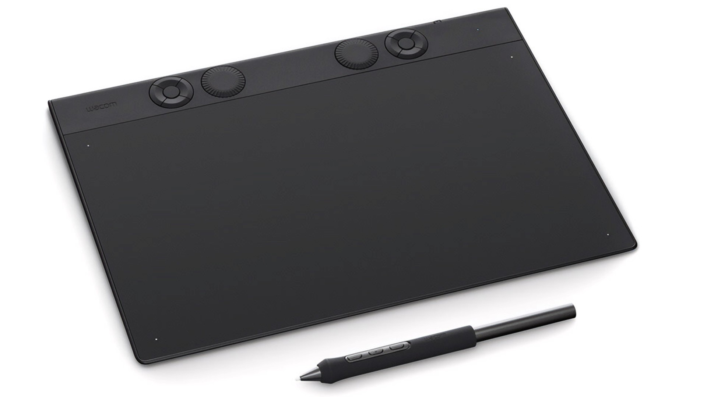<figcaption></figcaption></figure>

<figure>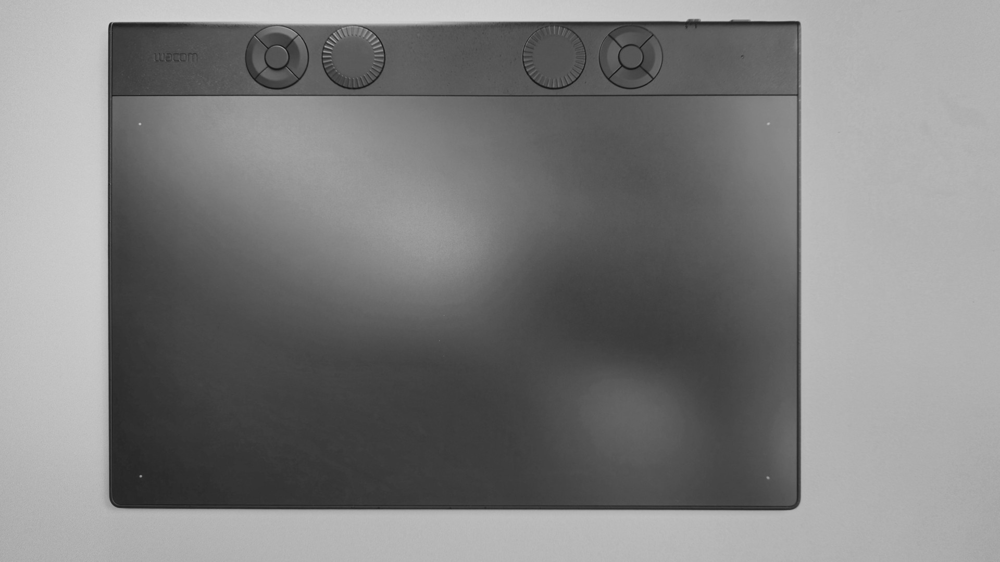<figcaption></figcaption></figure>

<figure>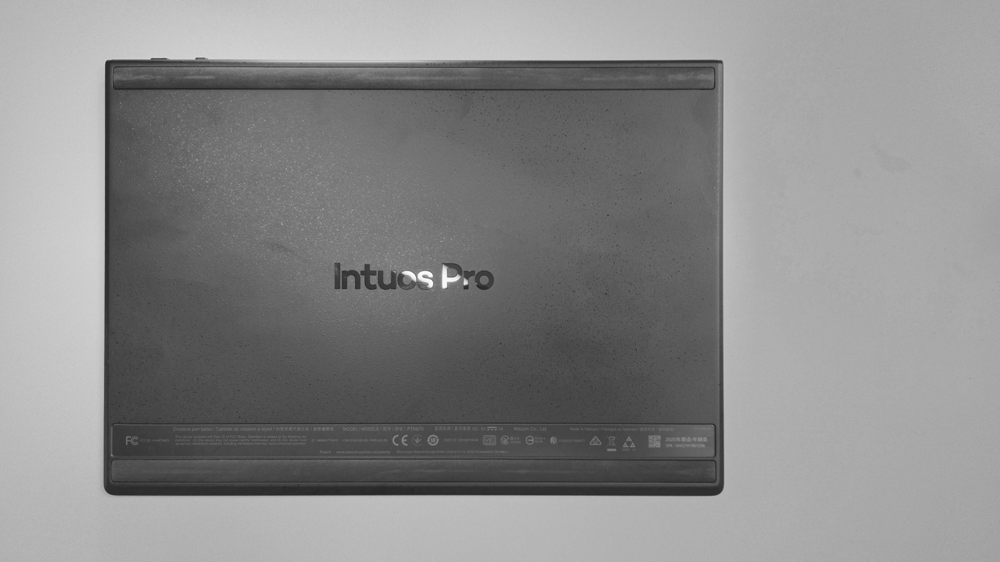<figcaption></figcaption></figure>

One of the interesting design touches, is a slight texture on the non-drawing surface os the tablet.

<figure>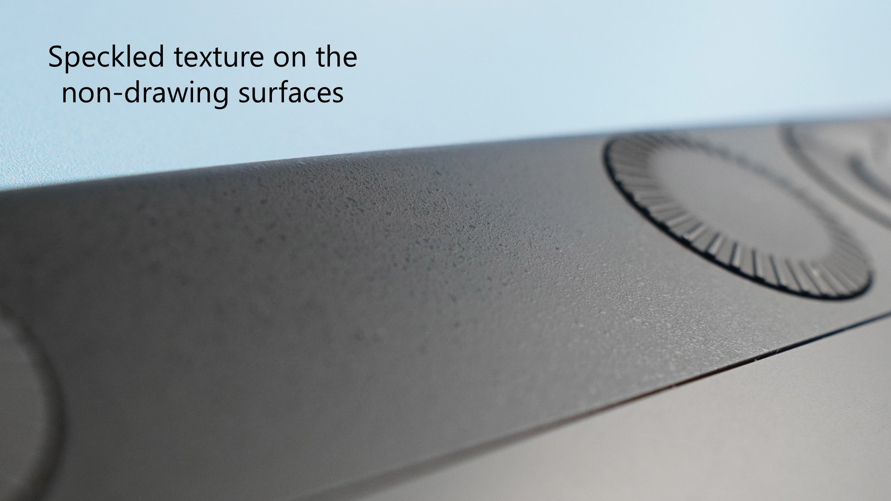<figcaption></figcaption></figure>

## What's in the box

Nothing too surprising, you get the tablet, pen, pen stands, and nibs.

<figure>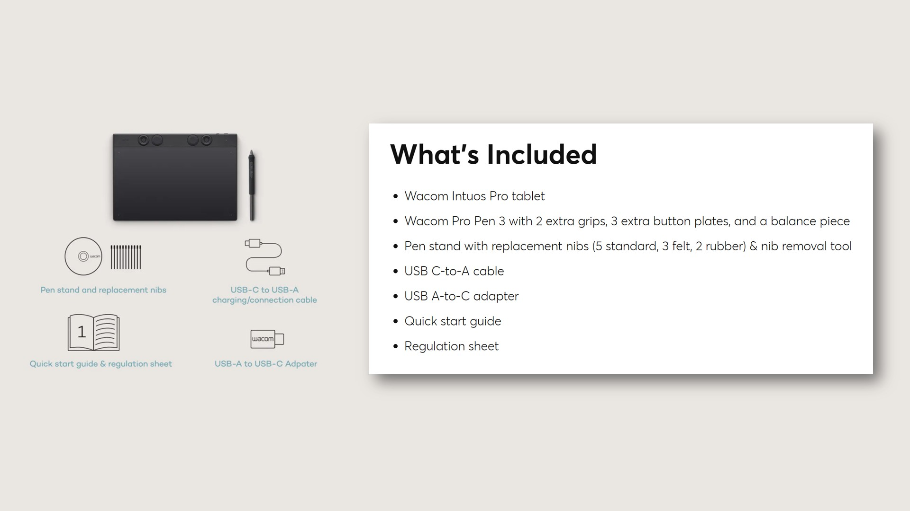<figcaption></figcaption></figure>

## The tablet only comes with 1 pen

This is a little bit of a disappointment. Some other brands are starting to include 2 pens with some of their professional models.

For example, as of April 2025, here is a **partial** list of tablets that come with two pens

* Xencelabs Pen Tablet Medium
* Huion Kamvas Pro 19
* Huion Kamvas Pro 27
* XP-Pen Artist Pro 19 GEN2

## Core specs

* Pressure levels - 8192
* Digitizer resolution - 5080 LPI (200 LPmm)
* Tilt - Yes
* Tilt range - ± 60°
* Report rate - Unknown – will investigate&#x20;

## Barrel rotation

Although the included Pro Pen 3 does not support barrel rotation. You can use the Wacom Art Pen (KP-701E) that does support rotation with the tablet.&#x20;

## Drawing performance

**Summary:** The drawing performance is excellent and keeps the same quality as the previous Intuis Pro 2017 edition.

### Moving between high and low pressure worked well

<figure><figcaption></figcaption></figure>

### Diagonal wobble

EVALUATION: Very good. Low amount of diagonal wobble. Similar to Intuos Pro 2017 edition.

<figure><figcaption></figcaption></figure>

## Tilt compensation

EVALUATION: VERY GOOD

Even as I tilted the pen at different angles, the pointer did not deflect much from the tip of the pen.

## Pointer lag

EVALUATION: VERY GOOD (VERY LOW)

As expected, the pointer trailed the physical tip of the only by a little bit. It was about the same as the pointer lag of the Intuos Pro 2017 model. In general, Wacom has excellent, low pointer lag in their pen tablets.

## Auxiliary inputs

### Multitouch

Unlike the previous Intuos Pro 2017 (PTK-x60) series, the Intuos Pro 2025 (PTK-x70) series does **NOT** support multitouch.

### ExpressKeys and dials

The PTK-x70 series tablers comes with pairs of ExpressKey rings and dials.

<figure><figcaption></figcaption></figure>

Though do be aware that the number of ExpressKeys and dials depends on which size tablet in the PTK-x70 series you get.

<figure>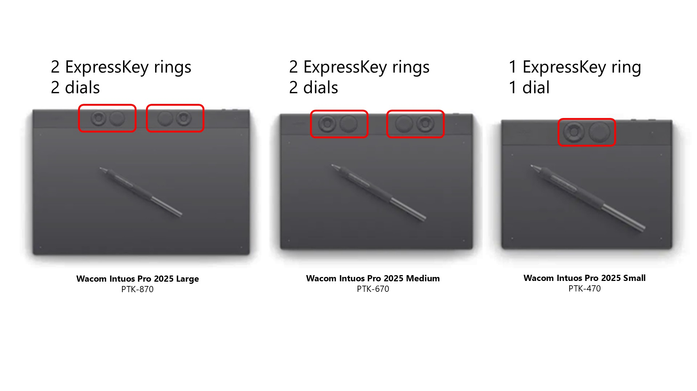<figcaption></figcaption></figure>

## Accidentally pressing the ExpressKeys and dials

It is possible to accidentally hit he ExpressKeys and dials depending on how the tablet is configured on your keyboard.

**Tablet next to keyboard** - no accidental presses&#x20;

<figure>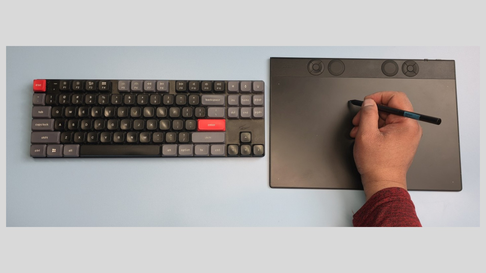<figcaption></figcaption></figure>

**Tablet underneath the keyboard** - no accidental presses while drawing, but accidental presses did happen when reaching for keys toward the top of the keyboard.

<figure>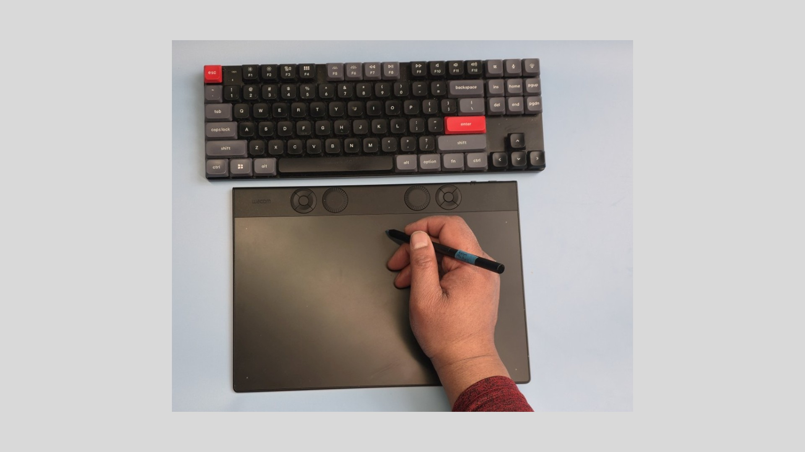<figcaption></figcaption></figure>

<figure>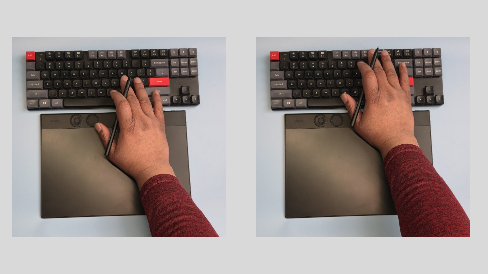<figcaption></figcaption></figure>

**Accidental presses were not possible in the way draw** - I use a tourbox device. So my keyboard is not near the tablet at all. So accidental presses did not happen for me.

<figure>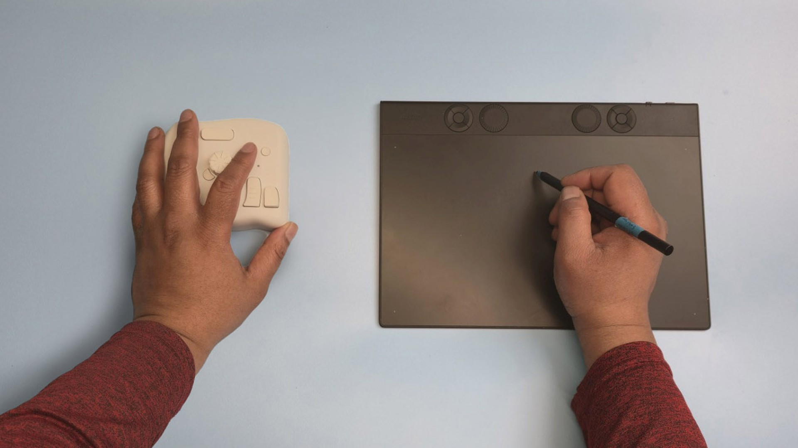<figcaption></figcaption></figure>

**Ultimately, I disabled all the ExpressKeys and dials** - I simply did not need them.

<figure>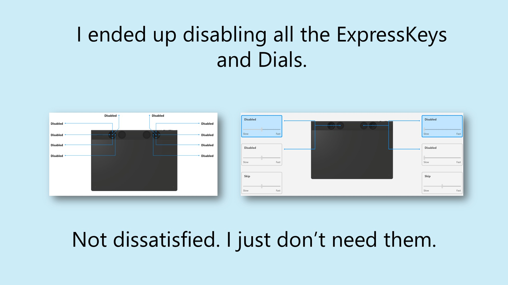<figcaption></figcaption></figure>

**I did accidentally hit the ExpressKeys when I meant to hit the dial and vice versa**. They are very similar in size, shape, and close together. Often I reached and touched the wrong one. Over time I may have been to train my brain a bit better.

## Usage notes on dials

* Be aware that the dials only support Rotation. They do not support pressing the dial as a third action. This is not a problem, but I am just used to being able to do that with the TourBox dials so I wanted to mention it.&#x20;
* The dials feel nice to rotate. Rotating produces soft click feeling and small sound.
*
  The dials do not rotate too easily nor do they require too much force to rotate.

## Usage notes on ExpressKeys

* It is not obvious in pictures but the ExpressKey rings have 5 buttons. The fifth button in the middle is used to switch what the other 4 buttons do.

<figure>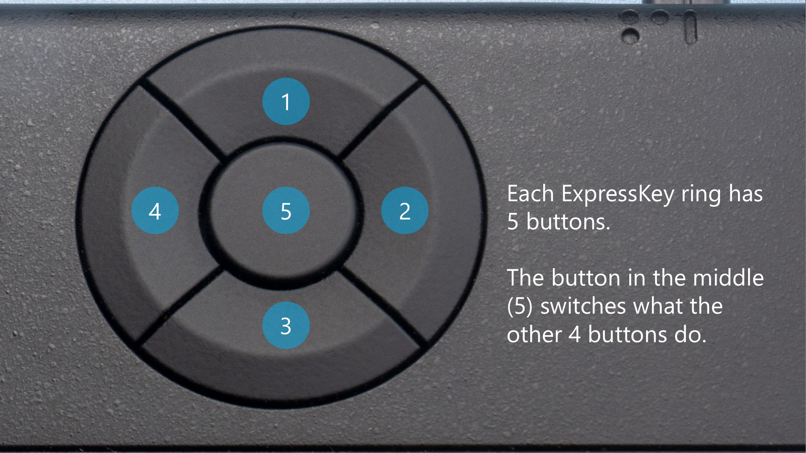<figcaption></figcaption></figure>

## Size (physical and active area)

Physically the new devices are smaller than their 2017 counterparts. but their active areas have grown in size. So, you have more room than every for drawing despite the sizes of the devices shrinking.&#x20;

<figure><figcaption></figcaption></figure>

The 2017 models had unusal aspect ratios, while the new devices all have 16x9 (or incredibly close to it) aspect ratios. This has a nice consequence. If you use a 16x9 monitor you have to turn on Force Porportions to draw normally with the 2017 models. But FP is not needed and has no effect on the new models with a 16x9 monitor. Because a mismatch in aspect ratios between the pen tablet's active area and the monitor causes Force Proportions to stop using some amount of active area ... when you take this into account the new tablets in practice give you much more active area than the 2017 models.

<figure>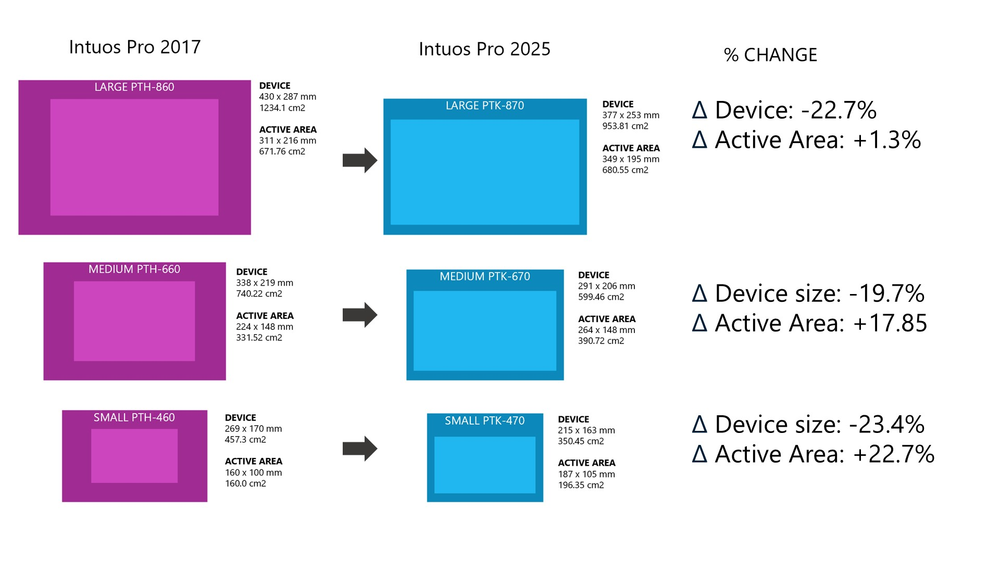<figcaption></figcaption></figure>

Also note that the new Intuos Pro 2025 large is physically very close in size to the Intuos Pro 2017 medium. This may make the 2025 large model a bit easier to place on the desktop for those of you interested in a large pen tablet.

<figure>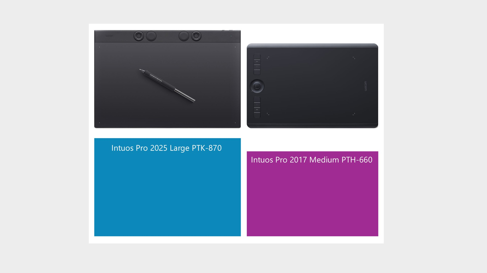<figcaption></figcaption></figure>

<figure>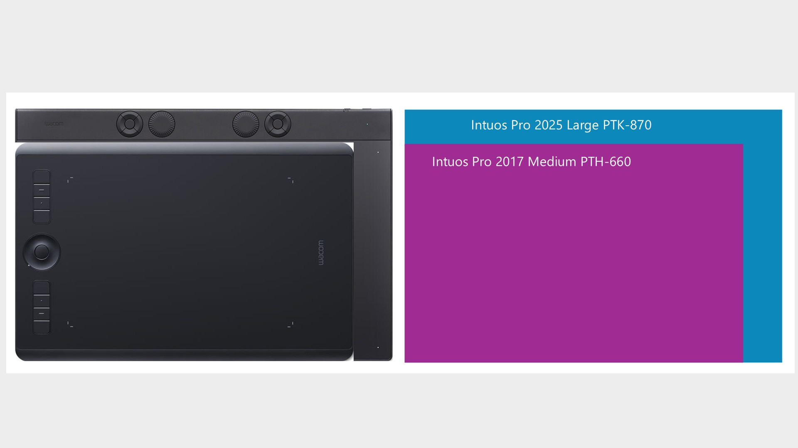<figcaption></figcaption></figure>

##

##

##

## Connections and ports

* These tablets support both wired and wireless connection.
* USB-C Port location: top right
* Multiple wireless connections: TBD

##

## Texture sheets

Wacom sells texture sheets in case you scratch up the drawing surface and want to restore it to its original pristine state. The texture sheets are available in 3 sizes (Large, Medium, Small) and only one texture (Standard).

## Device size

<table><thead><tr><th width="140.20001220703125">Size category</th><th width="183.39996337890625">Intuos Pro 2017</th><th width="186.800048828125">Intuos Pro 2025</th></tr></thead><tbody><tr><td>LARGE</td><td>
PTH-860

430 x 287 mm

1234.1 cm2
</td><td>
PTK-870

377 x 253 mm
 953.81 cm2
</td></tr><tr><td>MEDIUM</td><td>
PTH-660

338 x 219 mm
 740.22 cm2
</td><td>
PTK-670

291 x 206 mm
 599.46 cm2
</td></tr><tr><td>SMALL</td><td>
PTH-460

269 x 170 mm
 457.3 cm2
</td><td>
PTK-470

215 x 163 mm
 350.45 cm2
</td></tr></tbody></table>

## Bezel width

Bezels in general have shrunk dramatically. Only the top bezel has grown to accommodate the ExpressKeys and Dials. The numbers shown in the table below are approximate.

| Bezel side | 
Bezel

PTH-660
 | 
Bezel

PTK-670
 | Delta | %change |
| ---------- | -------------------------- | -------------------------- | ----- | ------- |
| TOP        | 30                         | 40                         | +10mm | +33.3%  |
| RIGHT      | 60                         | 10                         | -50mm | -83.3%  |
| BOTTOM     | 35                         | 10                         | -25mm | -71.2%  |
| LEFT       | 60                         | 10                         | -50mm | -83.3%  |

## Active area

<table><thead><tr><th width="140.20001220703125">Size category</th><th width="183.39996337890625">Intuos Pro 2017</th><th width="186.800048828125">Intuos Pro 2025</th></tr></thead><tbody><tr><td>LARGE</td><td>
PTH-860

311 x 216 mm
 671.76 cm2


</td><td>
PTK-870

349 x 195 mm
 680.55 cm2
</td></tr><tr><td>MEDIUM</td><td>
PTH-660

224 x 148 mm
 331.52 cm2
</td><td>
PTK-670

264 x 148 mm
 390.72 cm2
</td></tr><tr><td>SMALL</td><td>
PTH_460

160 x 100 mm
 160.0 cm2
</td><td>
PTK-470

187 x 105 mm
 196.35 cm2
</td></tr></tbody></table>

## Active area with Force Proportions enabled

<table><thead><tr><th width="140.20001220703125">Size category</th><th width="183.39996337890625">Intuos Pro 2017</th><th width="186.800048828125">Intuos Pro 2025</th></tr></thead><tbody><tr><td>LARGE</td><td>
PTH-860

311 x 174.94 mm
 544.06 cm2


</td><td>
PTK-870

349 x 195 mm
 680.55 cm2
</td></tr><tr><td>MEDIUM</td><td>
PTH-660

224 x 126.0 mm
 282.24 cm2
</td><td>
PTK-670

264 x 148 mm
 390.72 cm2
</td></tr><tr><td>SMALL</td><td>
PTH-460

160 x 90.0 mm
 144.0 cm2
</td><td>
PTK-470

187 x 105 mm
 196.35 cm2
</td></tr></tbody></table>

## Aspect ratio

<table><thead><tr><th width="140.20001220703125">Size category</th><th width="183.39996337890625">Intuos Pro 2017</th><th width="186.800048828125">Intuos Pro 2025</th></tr></thead><tbody><tr><td>LARGE</td><td>
PTH-860

TBD


</td><td>
PTK-870

16:9 (1.79)
</td></tr><tr><td>MEDIUM</td><td>
PTH-660

TBD
</td><td>
PTK-860

16:9 (1.784)
</td></tr><tr><td>SMALL</td><td>PTH-460
 TBD</td><td>
PTK-460

16:9 (1.781)
</td></tr></tbody></table>

## Driver UI > Wacom Center vs Wacom Tablet Properties

&#x20;There are two driver configuration UIs available for Wacom tablets: Wacom Center and Wacom Tablet properties. For the Intuos Pro 2025, most features are available in both apps, but some are available only in Wacom Center.

Available in BOTH

* Tablet orientation
* Pen vs Mouse mode
* Screen area (full, portion, & specific monitors)
* Tablet area (full, portion, force proportions)
* Windows Ink&#x20;
* Tip feel (a.k.a. "the pressure curve")
* Pen Button actions

Available only in Wacom Center for Intuos Pro 2025

* ExpressKey actions
* Dial actions

## Pen compatibility testing

<table data-header-hidden><thead><tr><th width="262.20001220703125">Pen</th><th width="150.60003662109375">7P Tested?</th><th>Intuos Pro 2017 PTH-x60</th><th>Intuos Pro 2025 PTH-x70</th></tr></thead><tbody><tr><td>Wacom Pro Pen 3 (ACP-500)</td><td>TESTED</td><td>NO</td><td>YES</td></tr><tr><td>Pens using “Wacom UD EMR”</td><td>TESTED</td><td>NO</td><td>YES</td></tr><tr><td>Wacom Pro Pen 2 (KP-504E)</td><td>TESTED</td><td>YES</td><td>YES</td></tr><tr><td>Wacom Pro Pen Slim (KP-301E)</td><td>UNTESTED</td><td>YES</td><td>YES</td></tr><tr><td>Wacom Pro Pen 3D (KP-505)</td><td>UNTESTED</td><td>YES</td><td>YES</td></tr><tr><td>Wacom Grip Pen (KP-501E)</td><td>TESTED</td><td>YES</td><td>YES</td></tr><tr><td>Wacom Pro Pen (KP-503E)</td><td>TESTED</td><td>YES</td><td>YES</td></tr><tr><td>Wacom Art Pen (KP-701E)</td><td>TESTED</td><td>YES</td><td>YES</td></tr><tr><td>Wacom Airbrush Pen (KP-400E)</td><td>UNTESTED</td><td>?</td><td>?</td></tr><tr><td>Wacom 4K pen (LP-1100K)</td><td>TESTED</td><td>NO</td><td>NO</td></tr><tr><td>Wacom 2K pen (LP-190)</td><td>TESTED</td><td>NO</td><td>NO</td></tr></tbody></table>
