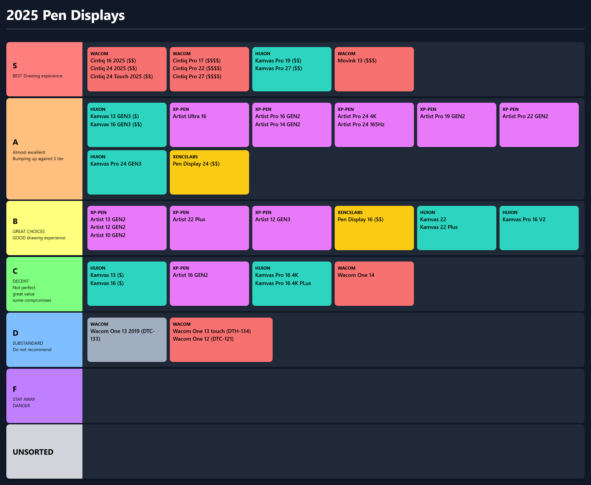
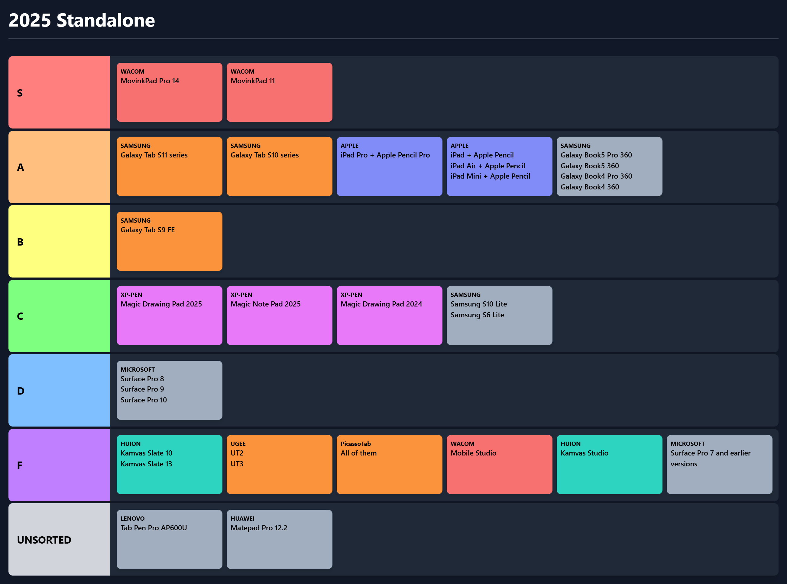
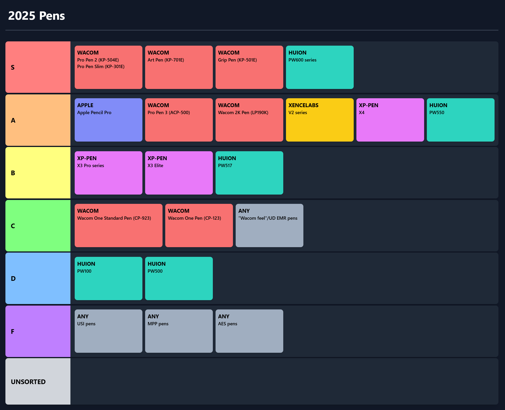

# 2025 Drawing tablet tier list

To see the previous tier list: [2024 Drawing tablet tier list](2024-drawing-tablet-tier-list.md)

## How the tiering is done

* Price is NOT considered
* The primary consideration is drawing experience and, for tablets with screens, their display experience
* The only ranking is the different tiers
* Tablets are not left-right ordered within a tier&#x20;

## Differences from 2024 tiering

On November 12, 2025, during a livestream as a community we created a new drawing tablet tier list.

Unlike last year

* In addition to pen tablets and pen displays, we also ranked standalone tablets, and pens
* Instead of 1 single tier list, we created one for each category
* Instead of using a pre-built tier maker, we used a vibe coded one built in 3 hours using Google AI Studio.

## Livestream



## Livestream vs this page

As always, as I learn more and get feedback I update the tier lists shown on this page.

## Tiering strategy

* COST does not affect the tier
* TIERING and RECOMMENDATIONS are based on overall DRAWING EXPERIENCE
* Some tablets might be not recommended (for drawing), but they might work well for note-taking, whiteboarding, etc. - tasks that are not about creative drawing/painting.
* Pens are the primary determinant of how pressure works for a tablet (IAF, MAX PRESSURE, PRESSURE RANGE). So it is always important to understand the included pen for tablet.
* UD-EMR pens offer OK performance. So tablets with UD EMR pens TEND to be the C tier.

## Tier definitions

<figure><figcaption></figcaption></figure>

## Pen tablets

<figure><figcaption></figcaption></figure>

## Pen displays

<figure><figcaption></figcaption></figure>

## Standalone

<figure><figcaption></figcaption></figure>

## Pens

<figure><figcaption></figcaption></figure>

