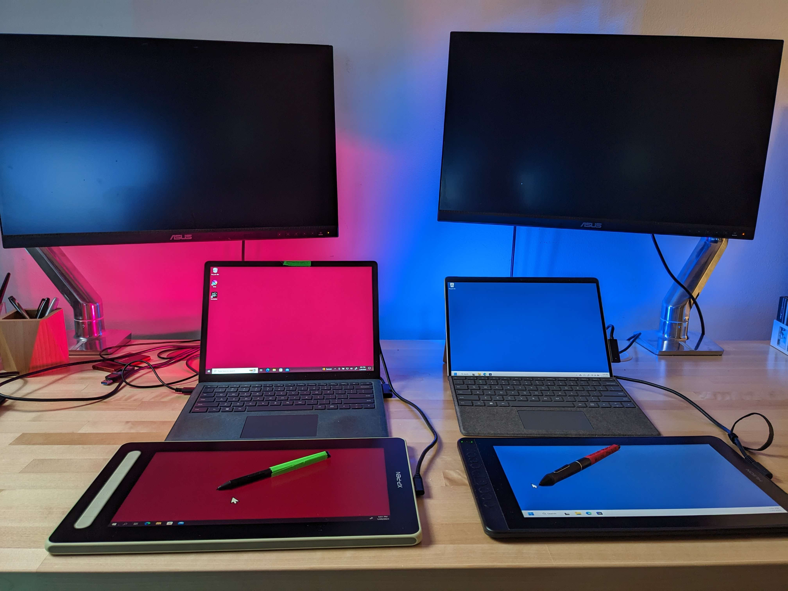
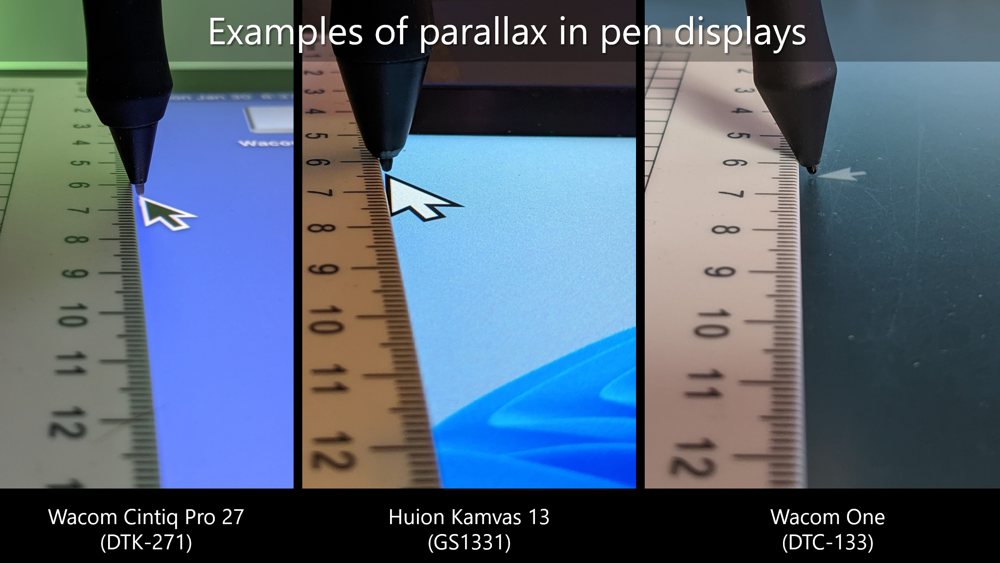

# 2023 13" pen displays compared

## Overview

13" pen displays very popular, often representing great choices for beginners. In this document I compare some popular options in the market in 2023.

* Huion Kamvas 13 (GS1331) - [Huion Kamvas 13 (GS1331) notes](../../catalog/drawtabs/huion/huion-kamvas/huion-gs1331-notes.md) | model year 2020
* XP-Pen Artist 13 GEN2 (CD130FH) - [XP-Pen Artist 13 GEN2 (CD130FH) notes](../../catalog/drawtabs/xppen/xppen-pen-displays/xppen-cd130fh.md) | model year 2022
* Wacom One 2019 GEN1 (DTC-133) - [Wacom One 2019 (DTC-133) notes](../../catalog/drawtabs/wacom/wacom-one/wacom-dtc133-notes.md) | model year 2019

## Summary

These are very, very similar tablets. There is NO CLEAR winner - each has positives and negatives.

* Huion Kamvas 13
  * slightly less pointer lag (GOOD)
  * slightly more more anti-glare sparkle
* XP-Pen Artist 13 GEN2
  * a tiny bit more pointer lag
  * less anti-glare sparkle

## Links

* [Teoh on Tech review of XP-Pen Artist 13 GEN2](https://youtu.be/-q_eFIuibnc)
* [Create Now Sleep Later review of XP-Pen Artist 13 GEN2](https://youtu.be/NJRYgW63dyM)

## Evaluation notes

#### Testing Setup

* **Driver versions used**
  * Huion: 15.6.2.80
  * XP-Pen: 3.4.0
* **Operating system of test machine**
  * Huion: Windows 11
  * XP-Pen: Windows 10
* **Specs**
  * The tables of specs come from the Huion and XP-Pen websites. For some specs, I did some testing to come up with the numbers.
* **Variances**
  * Please remember that how tablets work can vary even with tablets that have the same model number. I cannot guarantee everyone will experience what I encountered.
* **Pen labeling**
  * I used gaffer tape to identify the pens. Green = XP-PEN, Red=Huion.

## Pens

* X-Pen Artist 13 GEN2 - X3 ELITE
* Huion Kamvas 13 - PW517
* Wacom One 2019 GEN1 - CP-913

## Center versus Corner accuracy

Accuracy in both tablets is very good for a pen display

In my testing

* Both have similar center accuracy. I agree with their listed specs of ±0.5mm
* Both have similar corner accuracy. I measured at ± 2mm

## Diagonal wobble

Both tablets have excellent diagonal wobble (i.e. very low amounts of diagonal wobble) with both slow and fast strokes.

XP-Pen Artist 13 GEN2 (CD130FH) wobble

.png>)

Huion Kamvas 13 (GS1331) wobble:

.png>)

Compare it to the most expensive pen tablet wacom makes the Wacom Intuos Pro Large (PTH-860):

.png>)

Both the Huion and XP pen are on par with

## Anti-glare sparkle

Both tablets exhibit some anti-glare sparkle. Ideally tablets should exhibit no sparkle.

* iPad -> no observable sparkle
* Wacom Cintiq Pro -> very low sparkle
* Wacom One -> low sparkle
* XP-Pen Artist 13 (2nd gen) -> On the low end of moderate sparkle
* Huion Kamvas 13 -> moderate sparkle

For both tablets you'll notice the sparkle if your eyes are close, at a normal drawing distance I don't notice it.

The XP-Pen tablet is clearly the winner over the Huion tablet for AG sparkle.

## Drawing Experience

Both tablets handle these cases well

* drawing lots of dots
* drawing many small quick tiny low pressure lines - hatching
* keeping pressure constant
* moving between high and low pressure smoothly
* Tapering - typical for every pen display I've seen.

Overall drawing experience is very good for both tablets.

## Pressure range

* Remember: Pressure is detected by the pen, not the tablet.
* The lower bound on the pressure range is called the Initial Activation Force.
* To test this I hung each pen from a string and dragged the tip of the pen across the surface. The goal is that the minimal weight for the pen will draw a continuous line. Here's how they ranked:
  * XP-Pen Artist 13 2nd Gen -> made no marks whatsoever
  * Huion Kamvas 13 -> half the time made a mark. if pen moves slowly mark is captured usually but if there the pen is moving a little faster the mark is not registered.
  * Wacom One -> about same as the Huion Kamvas 13
  * Wacom Intuos Pro Large (PTH-860) -> draws a continuous line
  * Huion Giano (G930L) -> draws a continuous line
* Between the two, Huion is the clear winner with its lower IAF.

## Pointer lag

Both Huion and XP-pen models tested exhibit the typical pointer lag present with all pen displays. The lag is comparable to the Wacom One pen display (DTC-133).

Manufacturers don't publish lag numbers. So, this is subjective:

* The Huion has about the same amount of lag as the Wacom One
* The XP-Pen model has a bit more more lag than the Huion model

Both tables can be successfully used for creative applications. But Huion is the winner here over the XP-Pen model.

## Parallax

Thanks to their laminated displays both have very good parallax. They match that of Wacom One.

Below is a parallax photo for several pen tablet models. The XP-Pen parallax similar to the picture of the Wacom One and Huion model in the photo.

## Connecting with a 3 in 1 cable

Both tablets come with a 3-in-1 cable.

The end that goes into the tablet is USB-C.

The other 3 ends are:

* HDMI - connect to computer
* USB-A for data - connect to computer
* USB-A for power - this cable is colored red.
  * if your computer can provide enough power you can plug the cable into the computer
  * Or you can connect to a USB power adapter. Neither tablet comes with a USB power adapter.

## Connecting with one USB-C cable

For both tablets, I was able to use a single USB-C cable to connect them to the computer. More here: [Connecting a pen display with USB-C](../../guides/connecting/connecting-pen-display/connecting-pen-display-usbc.md)
