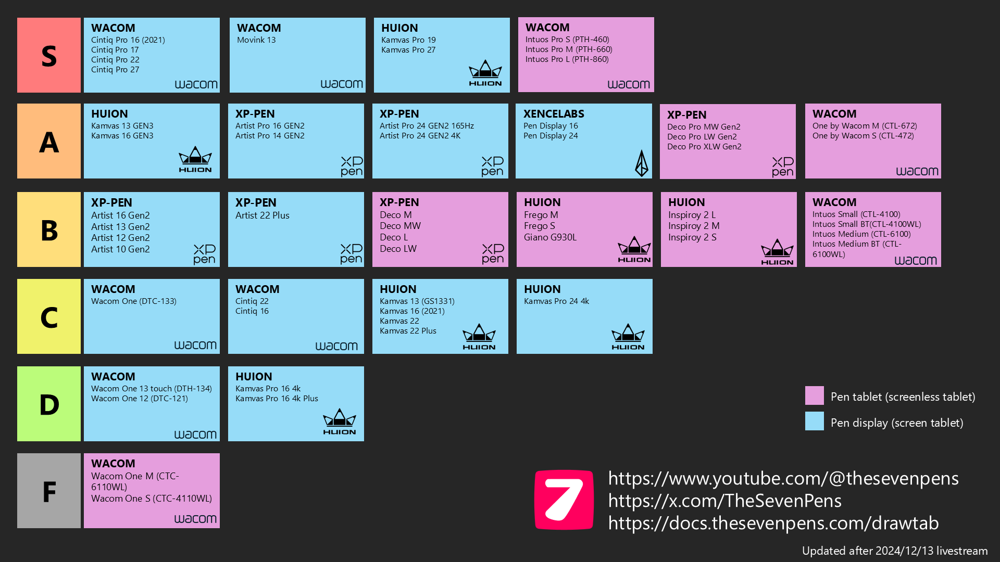

# 2024 Drawing tablet tier list

This is an updated tier list from the original livestream: [https://youtube.com/live/CKki6AEzdzA](https://youtube.com/live/CKki6AEzdzA)

To see the next year's tier list: [2025 Drawing tablet tier list](2025-drawtab-tier-list.md)

The updated tier list has a couple of changes I implemented after talking to some tablet enthusiasts:

* Added Huion Kamvas 16 GEN3 to A tier
* XP-Pen Deco Pro GEN2 moved from S tier to A tier
* Wacom One M and Wacom One S moved to new F tier
* Some cards in the same tier merged for a brand

<figure><figcaption></figcaption></figure>
