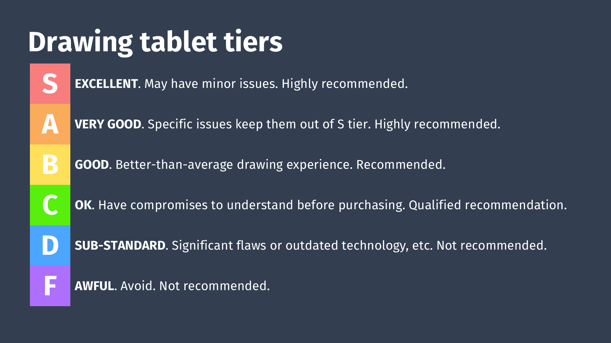

# 2025 Drawing tablet tier list

## How the tiering is done

* Price is NOT considered
* The primary consideration is drawing experience and, for tablets with screens, their display experience
* The only ranking is the different tiers
* Tablets are not left-right ordered within a tier
* The tiering reflects my opinion as well as feedback from others, collected during a livestream on Nov 12, 2025

## Differences from 2024 tiering

Unlike the [2024 Drawing tablet tier list](2024-drawtab-tier-list.md):

* In addition to pen tablets and pen displays, we also ranked standalone tablets, and pens
* Instead of a single tier list, we created one for each category
* Instead of using a pre-built tier maker, we used a vibe-coded one built in 3 hours using Google AI Studio

## Livestream



## Livestream vs this page

As always, as I learn more and get feedback I update the tier lists shown on this page.

## Tiering strategy

* COST does not affect the tier
* TIERING and RECOMMENDATIONS are based on overall DRAWING EXPERIENCE
* Some tablets might not be recommended for drawing, but they might work well for note-taking, whiteboarding, etc. These tasks are not about creative drawing or painting.
* Pens are the primary determinant of how pressure works for a tablet (IAF, MAX PRESSURE, PRESSURE RANGE). So it is always important to understand the pen included with the tablet.
* UD-EMR pens offer OK performance. So tablets with UD EMR pens TEND to be the C tier.

## Tier definitions

<figure><figcaption></figcaption></figure>

## Pen tablets

<figure><figcaption></figcaption></figure>

## Pen displays

<figure><figcaption></figcaption></figure>

## Standalone

<figure><figcaption></figcaption></figure>

## Pens

<figure><figcaption></figcaption></figure>

