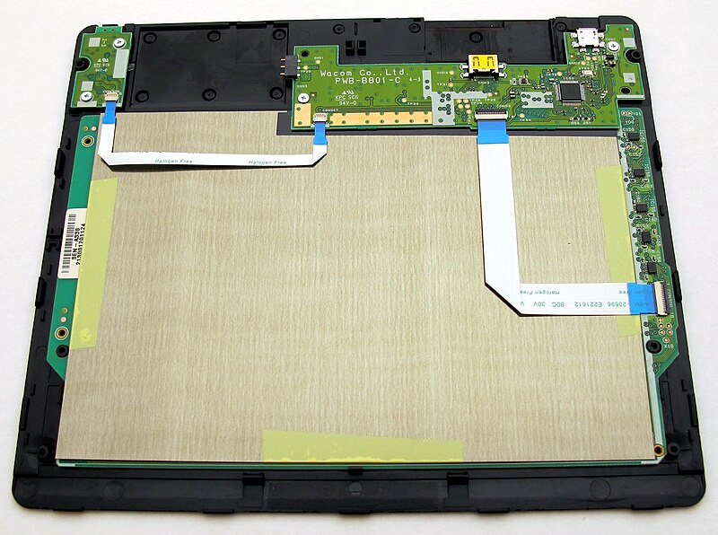

# EMR position detection

## Overview

The starting point for understanding EMR is learning how the tablet detects the position of the pen. Once this is known, many other aspects of the tablet can be understand.&#x20;

The tablet and pen are communicating with each other. They swap between listening and transmitting an electromagnetic signal many times a second. This document focuses on the pen producing an electromagnetic signal that the tablet detects.&#x20;

Please keep in mind, this is a simplified, conceptual explanation. Naturally, the description leaves out many details.

## The EMR sensor (aka the digitizer)

The fundamental component of a drawing tablet the EMR sensor. The more common name for this is **digitizer**.&#x20;

The digitizer is a printed circuit board (PCB) that contains:

* Some chips
* Some firmware code running in some of this chips
* a set of coils (wires) laid out on the PCB. The coils that are laid out vertically are clearly visible. The horizontal coils are partially visible as darker regions on the green PCB.&#x20;

This is the top of the Wacom digitizer used in the Wacom Intuos Pen Small (CTL-480). This is a smaller version of a [much larger image](https://commons.wikimedia.org/wiki/File:Wacom\_ctl480\_sensor\_pcb\_top.JPG) on Wikipedia commons.

<figure><figcaption></figcaption></figure>

The bottom of the digitizer is below. You can see the [larger version here](https://commons.wikimedia.org/wiki/File:Wacom\_ctl480\_inside.JPG).

&#x20;

<figure><figcaption></figcaption></figure>

The digitizer has something underneath it (on top on the photo) - this is probably a thin piece of something metallic to prevent electromagnetic interference from this device to others from the bottom of the tablet.

In this view you can see chips on the digitizer PCB attached to other components inside the tablet.

Now that we know what the digitizer looks like, by exploring position detection, we can understand what we are seeing.

## Detecting a signal with a coil

The coil is a piece of wire that extends from a digitizer chip.&#x20;

NOTE:

* A real digitizer will have multiple chips, but in these diagrams only 1 or 2 chips are shown.
* The wire does not look like what you might think of as a "coil". If you look up an electromagnetic component called an "inductor" you'll realize why it has this name. Another doc covering the LC Circuit in EMR pens will explain it in more detail.

<figure><figcaption></figcaption></figure>

If the pen is sending an electromagnetic signal and is near the coil. The signal will induce a current in the coil. This is called electromagnetic induction - meaning a current in one thing is causing a current in something else even though they are not touching.  The chip registers the strength of this signal - I draw it as a light blue bar near the detector.  The closer the pen is the stronger the signal. If the pen is far enough away, there really isn't any current detected on the coil.

<figure><figcaption></figcaption></figure>

Key points

* At this stage, the signal on the coil tells us something about how far away the pen is, but nothing else.
* The coil is oriented vertically but it doesn't know the vertical position of the pen. The pen could be on the top or the middle or near the bottom and the coil wouldn't know it.

## An array of coils

Lets have multiple coils next to each other in a row horizontally. Each coil independently detects the signal from the pen. So the signal strength is different for each coil - and depends on how far away the pen is from that specific coil.

<figure><figcaption></figcaption></figure>

The pen is right on top of one coil so it has the strongest signal. As coils are further from the pen the strength diminishes. And of course some coils essentially don't detect any signal.

The coils are going up and down, but the set of coils are arranged horizontally. This arrangement means that the coils can detect the horizontal location of the pen, but again the coils have now idea were the pen is vertically.

## A grid of coils

Before we continue, I'm going to draw the coils in a simpler way. It will look like I am drawing them as a wire just sticking out of the detector, but really think of them as looping back into the detector. Drawing it this way will make looking at the later diagrams a bit easier.

<figure><figcaption></figcaption></figure>

Now we are going to have two arrays of coils. One is a horizontal array like we had above. But the other array is oriented vertically.

<figure><figcaption></figcaption></figure>

Now we are going but these arrays on top of each other.

<figure><figcaption></figcaption></figure>

I must stress this, even the diagram makes it look like the horizontal and vertical coils are touching - they are not touching at all. They are on two separate layers. None of the coils actually touch another coil.

## Basic position detection

With the coils arranged horizontally and vertically, the coils can detect the position of the pen. Th e  vertical coils detect the horizontal (x) position. The horizontal coils detect the vertical (y) position.

Again notice that multiple coils in each dimension are detecting the signal for the pen.

In this diagram below, the pen coincidentally is right on top of one vertical coil and one horizontal coil. As a result, a single strong peak signal for the both the horizontal and vertical components.&#x20;

<figure><figcaption></figcaption></figure>

## Interpolation of position

Drawing tablets do not have a large number of coils. Not thousands. Not hundreds. They have more like tens of coils for each of the horizontal and vertical dimensions.

The consequence of this very sparse arrangement of coils is that the vast majority of the time, the pen is NOT exactly on top of a specific coil. It's almost always between two coils. &#x20;

Also only a small number of coils detect the pen. For example in in any given dimension it could be only 4 coils that detect the pen.

<figure><figcaption></figcaption></figure>

In this case above the pen is exactly in-between two horizontal coils and exactly in-between two vertical coils. So now in both the horizontal and vertical directions, there isn't a single strong signal, two signals in each direction have the same value. So the tablet, can infer that the pen is exactly between coils in both directions.

And of course the pen may not not be exactly on or exactly in-between coils as shown below.&#x20;

<figure><figcaption></figcaption></figure>

So, a drawing tablet has to carefully look at the signal strengths to handle all these cases of the pen's position. Fortunately EMR tablets are very fast and accurate at doing this. In terms of resolution, a typical Wacom EMR tablet can identify 5080 different positions inside every inch - that's 200 different positions for every millimeter! As you can see, the resolution of detection is surprisingly good.

## Position at the corners and edges

When the pen is in the middle of the tablet, there are lots of coils that detect the pen.

But the pen can also be at the edge or corner of the grid of coils. In this case there are fewer coils detecting the pen.

<figure><figcaption></figcaption></figure>

<figure><figcaption></figcaption></figure>

With fewer coils detecting the pen in this scenario the tablet has less data to work with to estimate the position of the pen. You will notice this in almost all tablets - that as you get within about 3mm of the edges or corners the pointer will start to drift away from the tip of the pen.

This loss of accuracy is typical and is present in all tablets - even the most high-end professional ones.

Tablet manufacturers try to counteract this a little bit. The surface of the tablet will usually mark out the corners of the active area.

We represent the active area as a red box in this diagrams, you'll notice that the active area is not the full size of the grid. Instead it is inset a little bit. This helps the tablet identify the pens position at what you see as the active area.

<figure><figcaption></figcaption></figure>

