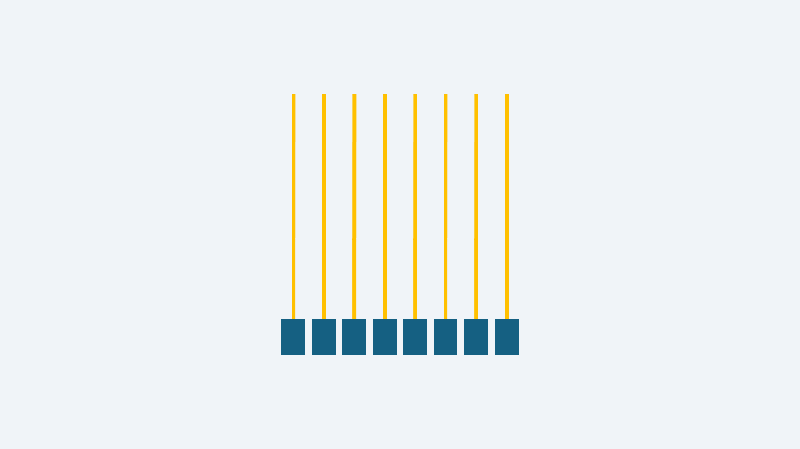

# EMR position detection

The starting point for understanding EMR is learning how the tablet detects the position of the pen.

Once you know this many other aspects of the tablet will make sense.

In this document, we'll slowly build up to how an EMR tablet detects the pen step by step.

First, realize that the tablet and pen are communicating with each other. They swap between listening and transmitting an electromagnetic signal many times a second.

We'll focus now on how the pen sending an electromagnetic signal to the tablet.

Please keep in mind, we are building up a conceptual understanding of how it works.

## Detecting a signal with a coil

A tablet will have elements called "coils". We can imagine it like a "signal detector" - which is just my wa of saying that there is something that measures current in the coil.

The coil is a piece of wire that extends from the detector and comes right back inside the detector.

I realize it does not look like what you think of as a "coil". If you look up an electromagnetic component called an "inductor" you'll realize why it has this name.

<figure><figcaption></figcaption></figure>

If the pen is sending an electromagnetic signal and is near the coil. The signal will induce a current in the coil. This is called electromagnetic induction - meaning a current in one thing is causing a current in something else even though they are not touching.&#x20;

<figure><figcaption></figcaption></figure>

The detector registers the strength of this signal - I draw it as a light blue bar near the detector.  The closer the pen is the stronger the signal.

If the pen is far enough away, there really isn't any current detected on the coil.

Some things to realize:

* At this stage, the detector of this coil essentially tells us something about how far away the pen is.
* The coil is oriented vertically but it doesn't know the vertical position of the pen. The pen could be on the top or the middle or near the bottom and the coil wouldn't know it.
* To be clear, EMR tablets do have coils - though they don't look quite like what I am drawing. They don't literally have a component called "signal detector". That detector is just a simple way for me to illustrate the position detection. &#x20;

## An array of coils

Lets have multiple coils next to each other in a row horizontally. Each coil independently detects the signal from the pen. So the signal strength is different for each coil - and depends on how far away the pen is from that specific coil.

<figure><figcaption></figcaption></figure>

The pen is right on top of one coil so it has the strongest signal. As coils are further from the pen the strength diminishes. And of course some coils essentially don't detect any signal.

The coils are going up and down, but the set of coils are arranged horizontally. This arrangement means that the coils can detect the horizontal location of the pen, but again the coils have now idea were the pen is vertically.

## A grid of coils

Before we continue, I'm going to draw the coils in a simpler way. It will look like I am drawing them as a wire just sticking out of the detector, but really think of them as looping back into the detector. Drawing it this way will make looking at the later diagrams a bit easier.

<figure><figcaption></figcaption></figure>

Now we are going to have two arrays of coils. One is a horizontal array like we had above. But the other array is oriented vertically.

<figure><figcaption></figcaption></figure>

Now we are going but these arrays on top of each other.

<figure><figcaption></figcaption></figure>

I must stress this, even the diagram makes it look like the horizontal and vertical coils are touching - they are not touching at all. They are on two separate layers. None of the coils actually touch another coil.

## Basic position detection

With the coils arranged horizontally and vertically, the coils can detect the position of the pen.

<figure><figcaption></figcaption></figure>

Now this diagram is awfully convenient. The pen coincidentally is right on top on vertical coil and one horizontal coil. So it is clear that one there is a single strong signal for the both the horizontal and vertical components.

Drawing tablets do not have a large number of coils. Not thousands. Not hundreds. They have more like tens of coils for each of the horizontal and vertical dimensions.

The consequence of this very sparse arrangement of coils is that the vast majority of the time, the PEN is NOT exactly on top of a specific coil. It's almost always between two coils. &#x20;

<figure><figcaption></figcaption></figure>

In this case above the pen is in between two horizontal coils and between two vertical coils. So in these cases, the tablet has to look at the signal strengths and estimate the position of the pen between the coils.

EMR tablets are very good at doing this. For example, a typical Wacom EMR tablet can identify 5080 different positions inside every inch - that's 200 different positions for every millimeter! As you can see, the resolution of detection is surprisingly good.

## Corners and edges

When the pen is in the middle of the tablet, there are lots of coils that detect the pen.

But the pen can also be at the edge or corner of the grid of coils. In this case there are fewer coils detecting the pen.

<figure><figcaption></figcaption></figure>

With fewer coils detecting the pen in this scenario the tablet has less data to work with to estimate the position of the pen. You will notice this in almost all tablets - that as you get within about 3mm of the edges or corners the pointer will start to drift away from the tip of the pen.

This loss of accuracy is typical and is present in all tablets - even the most high-end professional ones.

Tablet manufacturers try to counteract this a little bit. The surface of the tablet will usually mark out the corners of the active area.

We represent the active area as a red box in this diagrams, you'll notice that the active area is not the full size of the grid. Instead it is inset a little bit. This helps the tablet identify the pens position at what you see as the active area.

<figure><figcaption></figcaption></figure>

