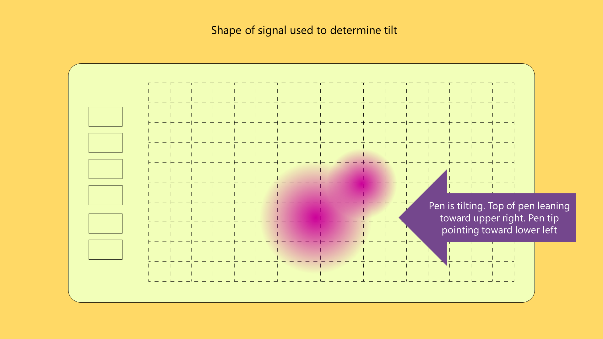

# EMR tilt detection

## Overview

EMR pens do NOT report the pens tilt to the tablet. For example it doesn't tell the tablet "I am tilted by 5 degrees"

Instead, an EMR digitizer can detect the tilt of the pen just by examining the strength and shape of the signal the digitizer coils receive from the pen.

## Details

When the pen is perpendicular, the digitizer detects a single perpendicular shape.

<figure><figcaption></figcaption></figure>

As the pen tilts, it produces two shapes. And the relationship between the two shapes indicates the tilt.

For example, in the diagram below, the pen is pointing to the lower left - meaning the top part of the pen is "falling" toward upper right of the tablet.

<figure><figcaption></figcaption></figure>

## **How tilt is reported to the computer**

* The tablet reported tilt as as an X tilt and a Y tilt number
* Below is what it looks like in the Diagnostics UI of the Wacom Driver for the Wacom Intuos Pro Large PTH-860
* 
* The X tilt reported by Wacom ranges from -64 to 63
  * a negative X value means that the pen is "falling" to the left of the tablet
  * a positive X value means the pen is "falling" to the right of the tablet
* The Y tilt reported by Wacom ranges from -64 to 63
  * a negative Y value means that the pen is "falling" to the top of the tablet
  * a positive Y value means the pen is "falling" to the bottom of the tablet
* If the X & Y are both zero, then the pen is perfectly perpendicular to the tablet

