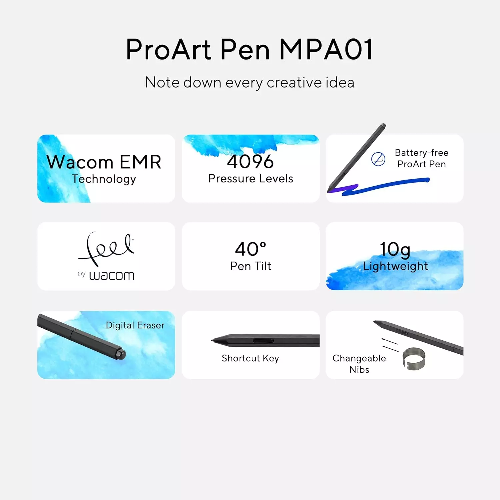
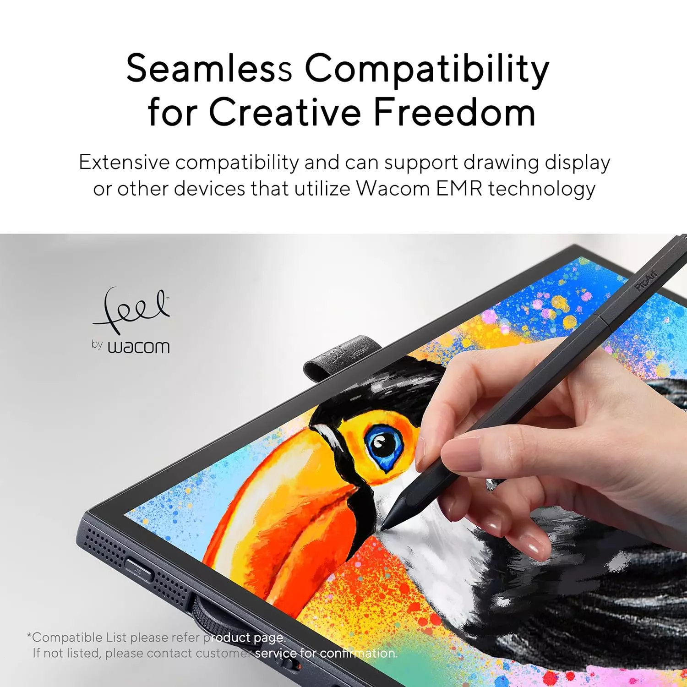

# Wacom UD EMR

## Overview

Wacom pioneered the use of EMR technology in drawing tablets.Wacom sells Wacom-branded drawing tablets that use this technology. There is a special branded version of this technology (called **Wacom UD EMR**) that uses in a small number of its tablets and that Wacom licenses to other manufacturers.

## Naming

Wacom UD EMR goes by several names

* Wacom UD EMR (UD stands for Ultra Digitizer)
* Wacom Feel EMR&#x20;
* Wacom Feel It EMR
* Feel by Wacom

I use "Wacom UD EMR" because most people who get deeply interested in drawing tablets use that name. &#x20;

## Adoption

### Non-Wacom devices

if you encounter a non-Wacom device that says it uses Wacom EMR, as far as we know, ALL these devices are using Wacom UD EMR.&#x20;

Examples of these kinds of devices are:

* Samsung Galaxy Tab S9 series
* Samsung Galaxy Book3 360

### Wacom entry-level devices

Welcome themselves use Wacom UD EMR technology in some their entry level tablets

\-        Wacom One 2019

\-        Wacom One 2023

However, NOT ALL entry-level Wacom tablets use UD EMR. For example the one by Wacom tablets (CTL-672, and CTL-472) do not use UD EMR.

### Wacom professional devices

For a long time NONE of Wacom's professional line of tablets used UD EMR.

That changed in 2024 with the introduction of the Wacom Movink 13. The Movink 13 supports both traditional Wacom EMR pens and supports Wacom UD EMR pens.

## Adoption in pens

### UD EMR pens from Wacom

* Wacom One 2019 pen (CP-913)
* Wacom One 2023 pen (CP-923

### Non-Wacom UD EMR pens

This is a **partial** list of known UD EMR pens

* Dr. Grip Digital for Wacom
* STAEDTLER Norris Digital Jumbo Stylus
* Samsung S Pen
* LAMY AL-Star black EMR Pen

## Wacom professional pens

Wacom pens such as the Wacom Pro Pen 2 and the Wacom Pro Pen 3 do NOT use Wacom UD EMR.

## Pen & tablet compatibility

A device that supports a UD EMR pen, very often, will work with any UD EMR pen. However this is not a strict rule. Sometimes there are **some exceptions**.

Here are a partial list of compatibility cases

* Samsung S pen can be used with Wacom One tablets and the Wacom Movink 13
* Wacom CP-913 and CP-923 pens can be used with Samsung Galaxy Tab S series

But there are cases where incompatibilities do exist

* Wacom CP-923 pen cannot be used with Wacom One 2019 tablet. I am not sure why this specific case does not work. I suspect it could be due to a deliberate forcing of incompatibility in the Wacom driver

## Limitations of UD EMR

### Pressure handling

Pens that use UD EMR seem deliberately limited in how well they handle pressure. They generally have higher initial activation force and lower maximum pressure. I believe that these limitations may be partially related to how the pens are manufactured but also I believe that some of the limitations are artificial and enforced by drivers. Overall the pressure handling of an UD EMR is never as good as what you will see in a Wacom professional pen. In fact it's almost always not as good as the pressure behavior you'd find in modern non Wacom EMR pens such as those from Huion and XP-Pen.

### Buttons

UD EMR pens tend to have only one button or in some cases no buttons. The Wacom CP-923 pen has two buttons- which is rare.  In my experience devices that assume you are using a UD EMR pen don't make use of a second button because they are only expecting a single button.

&#x20;Resources

* [Wacom: our key technologies](https://www.wacom.com/en-us/about-wacom/technologies)  - brief overview of UD EMR and AES

## Wacom Feel branding examples

Wacom has a "Feel by Wacom" trademark as shown below

<figure><figcaption></figcaption></figure>

You can see this how it is used in these materials for an ASUS product.

<figure><figcaption></figcaption></figure>

<figure><figcaption></figcaption></figure>

## Notes

* **AES** - Wacom also licenses another kind of pen technology that is not based on the EMR. This is called AES for Active-Electro-Static. This document is not talking about AES.

&#x20;
