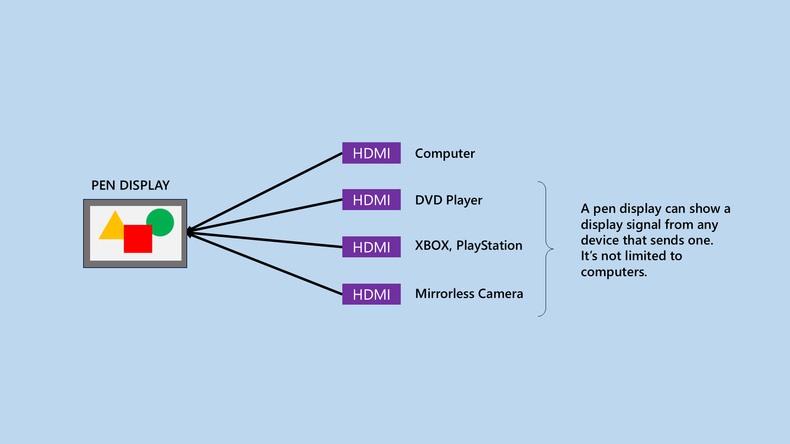

# DIAG: Checking if pen display shows HDMI video signal from other devices

## Overview

Among other things that a pen display receives from your computer, it also receives a "display signal". Display signal means essentially "video" - what you see on the pen display.&#x20;

Normally your pen display will be connected to your computer, which provides a display signal via an HDMI connection.

But your pen display can receive that display signal from any device that supports a display signal. For example an Xbox, PlayStation, a DVD player, another computer, and even some mirrorless cameras (example Sony FX30).

<figure><figcaption></figcaption></figure>

This is useful for several reasons.

\-        It allows your pen display to be used like a monitor or TV

\-        it's also a good troubleshooting technique

## Troubleshooting

If you're getting problems like one of these:

\-        Not seeing anything

\-        Odd Flickering

\-        Weird colors

\-        "No Signal"

Then connecting your pen display via HDMI to another device is a very useful technique, because it gives you a hint as to whether the problem is with the tablet itself or with your computer.

If one device does not work, try others. &#x20;
