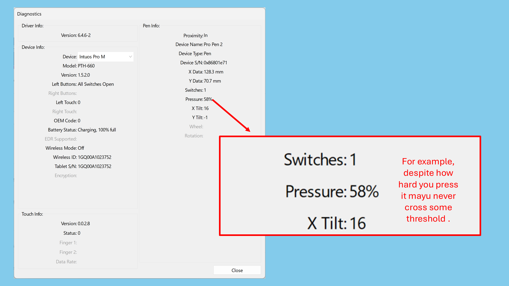

# TSG: Difficult to reach maximum pressure

## Overview

You may find that you have to press very hard to get to maximum pressure with your pen.

The components that detect pressure are inside the pen.

While it is not possible to adjust the pen itself, you might be able to improve the situation using the pressure curve in the driver or in an application.

## Verifying the problem in the tablet driver

If you are looking at a pressure reading while using your pen, you may see that it is either very difficult or impossible to reach 100% pressure.

<figure><figcaption></figcaption></figure>

This can be caused by several things

## Information to collect

Does this problem manifest in the driver?

Does it manifest in an application like Krita?

## Pen hardware issue

If it happens in the driver at all, then most likely there is something wrong with the pen hardware itself. Occasionally pen hardware can have a very high maximum pressure that is very large (I've seen up to about 5X) compared to what is normal for a pen.

### Example of a pen with abnormal max pressure

For example one of my Wacom pens requires so much force to get to 100% that, if I tried, I'm sure I would damage the pen.

Below you can see how different the pressure response of this pen is compared to every other pen I have.

<figure><figcaption></figcaption></figure>

### How to address

Because you cannot physically fix the problem, you have two options:

* Use pressure curves to address this problem
* Contact support for help and potentially get a replacement

### Using a pressure curve to a pen hardware problem

Try adjusting the pressure curve: More here: [Lowering maximum physical pressure](../guides/customizing/lowering-max-physical-pressure.md)

You might be able to do this is the tablet driver. If not do it in your application.

