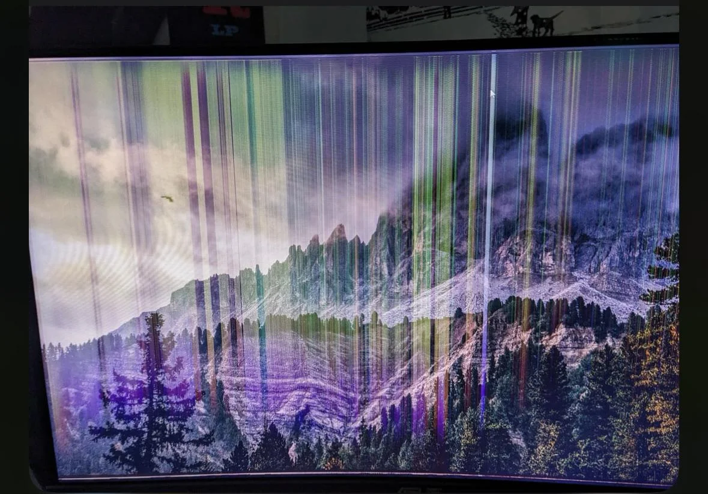
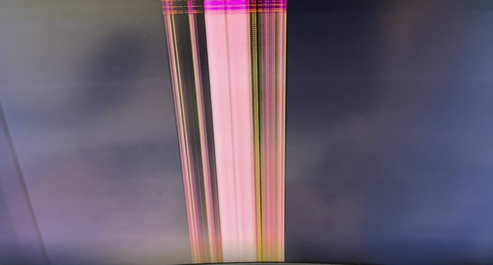

# TSG: Display has vertical lines

## Symptoms

The display shows vertical lines.

* It can be a small number of them or many
* They may be grouped closely together in one vertical band
* The lines may be spread all over the screen
* The lines may be of various colors: white, black, random colors

## Examples

<figure><figcaption></figcaption></figure>

<figure><figcaption></figcaption></figure>

## Causes

There are many things that might cause this. Some can be addressed, and some are fundamental hardware problems that cannot be fixed.

Where the issue might originate

* The display panel itself
* The configuration the computer is using for the video signal (refresh rate and resolution)
* The cable used to transmit the video signal
* The ports
* The GPU sending the video signal
  * Sometimes GPUs get into a weird state
  * sometimes GPUs have thermal problems

## Things to try or investigate

* Question: Do the lines appear even when the monitor initially starts up and shows its "Welcome" message?
* Question: Do the lines appear when there is no video signal being sent to the monitor (for example, the HDMI cable is disconnected)?
* Question: Do the lines appear for a while and then disappear
* Test with different cables
* Test with different video configurations
  * Different refresh rates
  * Different resolutions
* Test with a different video signal source (Xbox, another laptop, a camera)
* If you are getting a video signal from your GPU, try the motherboard

## Summary

Once you've completed your investigation, you might have solved the problem.

Try contacting customer support.

You should be prepared, though, that if the problem is a fundamental issue with the display panel, there is no way to fix it.

## Discussions

[r/techsupport - Monitor has colorful vertical lines sometimes but it isn't a hardware issue/card isn't artifacting](https://www.reddit.com/r/techsupport/comments/17bpya6/monitor_has_colorful_vertical_lines_sometimes_but/) - 2023-10-19

[https://www.reddit.com/r/techsupport/comments/17bpya6/monitor\_has\_colorful\_vertical\_lines\_sometimes\_but/](https://www.reddit.com/r/techsupport/comments/17bpya6/monitor_has_colorful_vertical_lines_sometimes_but/)

[https://www.reddit.com/r/pchelp/comments/1sjco64/monitor\_has\_vertical\_lines\_on\_start\_up\_why/](https://www.reddit.com/r/pchelp/comments/1sjco64/monitor_has_vertical_lines_on_start_up_why/)
