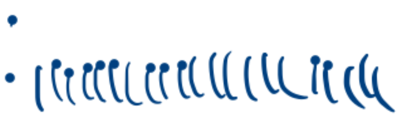

# TSG: Dots at start of strokes

## Overview

This symptom appears as dots at the start of strokes. It is almost as if the pen is "clicking" one extra time at the beginning.

The cause is unclear.

It can suddenly appear with a pen that otherwise was working correctly.

## Potential solutions

Try the [Common drawing troubleshooting steps](common-drawing-tsg-steps.md).

### Links

* ([**r/wacom - dots appear when i don't put one, why does this happen , how can i remove this...**](https://www.reddit.com/r/wacom/comments/s6wdud/dots_appear_when_i_dont_put_one_why_does_this/) 2022-01-18)
* ([**r/ClipStudio - big dots at start of strokes, need help**](https://www.reddit.com/r/ClipStudio/comments/1011a69/big_dots_at_start_of_strokes_need_help/) 2023-01-01) - This was solved by reinstalling Clip Studio Paint
