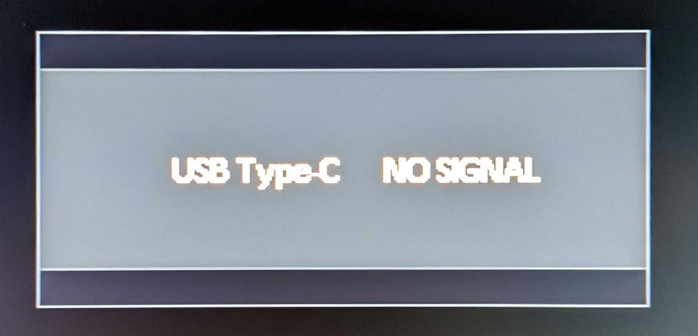
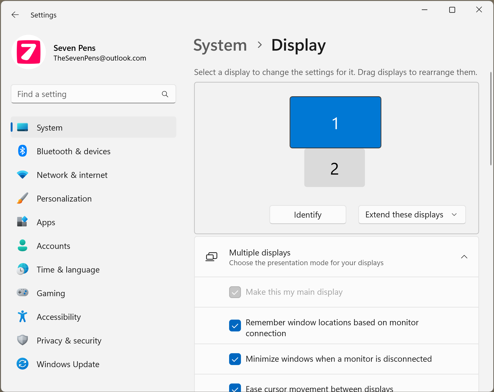
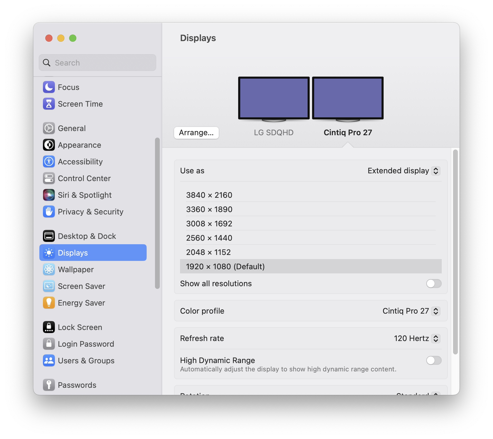

# TSG: Pen display shows NO SIGNAL message

## Overview

The "NO SIGNAL" message is very common with pen displays. Most often, you can fix it. However, it can be challenging to diagnose because so many factors are involved.

<figure><figcaption>
A typical no signal message. In this case, the message indicates that the USB-C port is where the pen display is looking for the signal.
</figcaption></figure>

Your pen display connects to your computer for two reasons:

* to send data to the computer - this lets the pen work
* to receive a video signal from the computer

NO SIGNAL means that the pen display is not receiving a video signal from the computer.

## Background information (<mark style="color:$danger;">WATCH THESE VIDEOS!!!</mark>)

Before you begin troubleshooting, I highly recommend watching these two videos. They contain a lot of helpful information. They also explain many of the terms and procedures used in this document.





## Setting expectations

This guide lists every tactic I am aware of that might help. However, even this guide may not be enough. <mark style="color:red;">**Ultimately, you should be prepared to contact your tablet manufacturer's customer support team.**</mark>

## NO SIGNAL but the pen still works

This is normal because the data connection and the video signal are separate.

## What you can tell from the NO SIGNAL message

The fact that you are seeing a NO SIGNAL message tells you that:

* **The pen display is getting enough power.** If it were not getting enough power, you would not see this message.
* **The backlight inside the display panel is working.** If the backlight were not working, this message would not be visible, or it would be incredibly difficult to read.
* **There is nothing wrong with the display panel itself.** If it is showing anything at all, the display panel is working.

### What POWER SAVING means

For some tablets, the NO SIGNAL message is accompanied by a POWER SAVING message. POWER SAVING means "The pen display is not receiving a display signal from the computer, so it is going to shut down instead of wasting energy while showing nothing." Ultimately, this message is telling you that the tablet is trying to save power, not that there is a power problem.

## Tablet drivers

In general, messing around with the tablet drivers will not help. Do not waste time reinstalling, upgrading, or swapping tablet drivers. While having the latest driver is usually a good idea, it is very unlikely to fix a NO SIGNAL problem.

## Things to verify

### Verify that the computer sees the tablet's display

Most computers already have one display, so when you plug in your tablet, the operating system should at least recognize that there are now two displays, including the one from your pen display.

In your operating system's **Display Settings**, you should see two displays. And one of them should be your tablet's display.

| Windows 11                                                                  | MacOS (Ventura)                          |
| --------------------------------------------------------------------------- | ---------------------------------------- |
|  |  |

If your computer does not see the display from the tablet, it will not send a video signal to it. Follow these troubleshooting steps: [TSG: Computer does not detect the display](tsg-display-detection.md)

### Verify that your operating system is trying to use the display

Sometimes your operating system knows the display is there, but it is deliberately not sending a video signal to it.

For example, in Windows, the display in your tablet might be configured to "show desktop only on Display \<X>". Change it to one of the other options that uses the tablet display.

### Verify that the pen display can receive an HDMI signal

Try connecting your pen display to another HDMI source. This can be another PC, a laptop, an Xbox, a camera, or anything else that sends a signal through HDMI.

### Verify that your computer can send an HDMI signal

Try connecting a monitor to the same HDMI port you want to use with your pen display.

### Verify cable connections

Verify that your cables are fully connected.

* Sometimes cables can sit in a port without fully "locking" in.
* Check for lint or any other foreign objects in the port. They can prevent the connection from working.

## Physically disconnect your pen display from power

* Follow ALL these steps in order. Do NOT skip any steps.
  * Turn off the tablet using the **power button**
  * Disconnect ALL cables from the tablet. ALL cables. Not just a power cable - ALL the cables.
  * Wait. (30 seconds to several minutes)
  * Reattach all the cables
  * Turn on the tablet.
* Variations to try
  * Some people recommend disconnecting power, then holding the tablet power button down for a long time, such as 30 seconds, before reconnecting.
  * Some people recommend leaving the tablet disconnected for an extended period, such as 30 minutes, before reconnecting.

## HDMI connection options

### The HDMI cable goes to your computer

The HDMI cable from your tablet GOES to your computer.

Do not connect the HDMI to your monitor. Monitors do NOT send HDMI signals; they only receive them. So connecting your pen display to your monitor will not work.

### Use a different HDMI port on your computer

Your computer may have multiple HDMI ports. Try different ones.

### GPU HDMI vs motherboard HDMI

In general, connect via the GPU HDMI ports instead of motherboard HDMI ports.

More here: [Motherboard HDMI vs GPU HDMI ports](../guides/connecting/connecting-pen-display/motherboard-vs-gpu-hdmi.md).

## USB-C connection options

**IF** your computer has a USB-C port that supports a display signal, there are a couple of options for you. More here: [USB-C DisplayPort Alt Mode](../guides/pen-displays/usbc-dp-alt-mode.md)

### USB-C to USB-C

If your tablet has a USB-C port and your computer has a USB-C port that supports DisplayPort Alt Mode, power, and data, then you might be able to use a USB-C to USB-C cable.

## HDMI adapters

If your PC has a DisplayPort or DVI output, or a USB-C port that supports DisplayPort Alt Mode, try an adapter. More here: [Using HDMI adapters with pen displays](../guides/pen-displays/hdmi-adapters/).

## Issues with HDMI Adapters

Sometimes adapters themselves can be the source of the NO SIGNAL problem.

* Try a different HDMI adapter.
* Try NOT using an HDMI adapter.

## HDMI Splitters

HDMI splitters can also be a bit "flaky" and can cause a NO SIGNAL problem. More here: [Using HDMI splitters with pen displays](../guides/pen-displays/hdmi-splitters.md)

* Try connecting WITHOUT an HDMI splitter.

## Try using your pen display as your only display

* If your computer has other displays connected, disconnect them and then **only** connect your pen display. Sometimes computers get tripped up when multiple displays are in use, so this can help force the system to use the pen display.
* If that works, start reconnecting the other displays until they are all plugged back in and working.

## Check if there is any difference when using mirror vs extend for your desktop

* Typically your PC will already have one monitor attached to it. So the pen display will be the second screen.
* You have two options in your operating system:
  * Mirror the contents of your desktop across both screens. This means they will show the same thing.
  * Extend the contents of your desktop across both screens. This means that the screens will show different things.
* If you are getting no signal in extended mode, try mirrored mode, and vice versa.

## Maximum number of display outputs on your graphics card

GPUs usually have multiple ports for sending a display signal. However, sometimes not all of them can be used at the same time.

Suppose your graphics card has four physical HDMI outputs. It is possible that the card supports only three of them at the same time. If you plug into the fourth port, you may get a no signal issue.

Read the documentation for your graphics card to verify how many active outputs it supports.

## Video refresh rates

If your computer recognizes that a display is attached, but you are still getting no signal, try changing the refresh rate the computer is using for that display.

Sometimes a misconfigured refresh rate causes the computer to stop sending a signal. For example, a Windows update can reset the refresh rate to an unsupported value. Changing it back to 60 Hz can make the display work again.

So always verify the refresh rate.

Start with a lower refresh rate, then work up to higher ones.

Typically, pen displays go only up to 60 Hz.

## Video resolution

If your computer recognizes that a display is attached, but you are still getting no signal, try changing the resolution the computer is using for that display.

Start with a very low resolution, then work up to higher resolutions.

## Get the tablet to work with another computer, then reattach it to your computer

Some users report that if they get NO SIGNAL with their pen display, they can connect it to another computer where it does work. Then, after it works there, they reconnect it to the first computer and it starts working there too.

See this reddit comment: [**r/huion - No signal - imac**](https://www.reddit.com/r/huion/comments/109wjgx/comment/j41ekyk/?utm_source=share&utm_medium=web2x&context=3) 2023-01-12

The reason this process might work is not clear. It could be because fully depowering the pen display helps. It could also be because the connection to the other computer changes something inside the pen display. In any case, it is worth a try if you continue to have problems.

## Wacom One 2019 (DTC-133) cable orientation

The Wacom One 2019 (DTC-133) is very sensitive to the orientation of the 3-in-1 cable in its USB-C port. Usually, the orientation that works is the one where the cable sticks out to the left side of the Wacom One.

## Tablet firmware updates

It sometimes happens that monitors require firmware updates before they can receive a display signal correctly. For example: [This ASUS monitor required a firmware update](https://www.asus.com/lk/support/FAQ/1045839/) to get video to work over USB-C.

IMPORTANT: Do not install firmware updates on the general hope that they will improve things. Please consult your manufacturer or support team to verify whether they recommend a firmware update to solve the problem.

## Possible triggers

One of the most surprising things about the NO SIGNAL problem is that it can occur on an existing working system. It's happened to me.

Here is what can trigger it:

* A GPU driver update
* An operating system update

## Other resources

### Reddit threads

* [**r/XPpen - Tips when there is "No Signal" and/or tablet is recognized as a keyboard and not as a display monitor for PC + additional stuff**](https://www.reddit.com/r/XPpen/comments/z2h51j/tips_when_there_is_no_signal_andor_tablet_is/) 2022-11-22

### Misc

* [https://www.windowscentral.com/how-fix-your-second-monitor-not-being-detected-windows-10](https://www.windowscentral.com/how-fix-your-second-monitor-not-being-detected-windows-10)
* [https://support.microsoft.com/en-us/windows/troubleshoot-external-monitor-connections-in-windows-10-5b46f4a4-9634-06bb-7622-f960facdfd49](https://support.microsoft.com/en-us/windows/troubleshoot-external-monitor-connections-in-windows-10-5b46f4a4-9634-06bb-7622-f960facdfd49)
* [TheHowToGuy123 - How To Enable Motherboard HDMI Port for Multiple Monitors - Use Graphics Card & Integrated Graphics](https://youtu.be/_Ftk8jQhsqE) Jul 3, 2020

### Manufacturer guidance

#### Huion

* General: [https://support.huion.com/en/support/solutions/articles/44001154156-what-to-do-if-your-huion-pen-display-shows-a-black-screen-or-no-signal](https://support.huion.com/en/support/solutions/articles/44001154156-what-to-do-if-your-huion-pen-display-shows-a-black-screen-or-no-signal)
* Huion support for Kamvas 13: [https://support.huion.com/en/support/solutions/articles/44001949665-how-to-fix-my-kamvas-13-no-signal-black-screen-problem-](https://support.huion.com/en/support/solutions/articles/44001949665-how-to-fix-my-kamvas-13-no-signal-black-screen-problem-)
