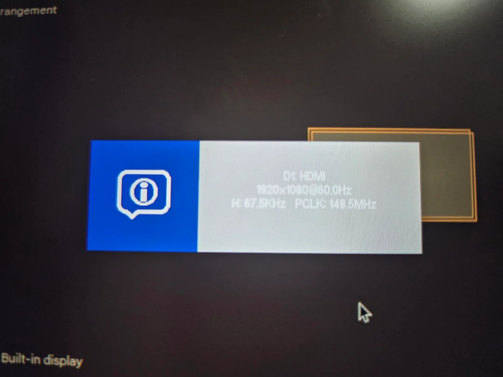
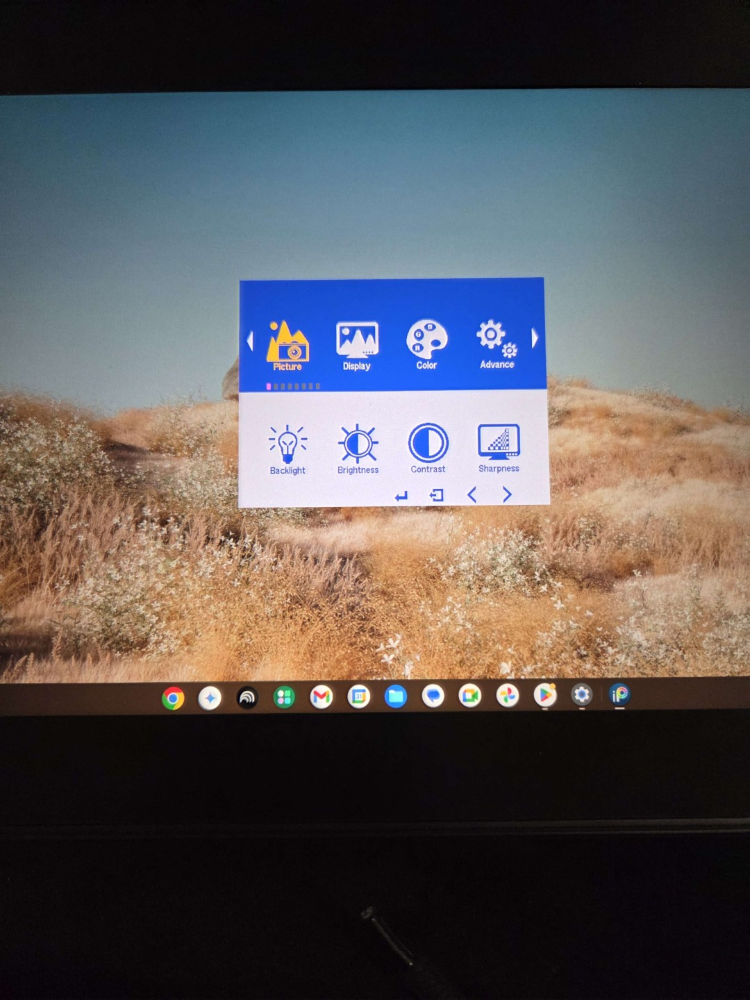

# TSG: Pen display always shows an info box on screen

## Background

Pen displays and monitors in general can show an information box like this on their screen when they start up.

<figure><figcaption></figcaption></figure>

Often this box lists some basic information such as:

* Which port is being used for the video signal
* The resolution and refresh rate being used

Usually this appears when the display is first turned on and will appear only for a few seconds.

## The problem

Sometimes this box doesn't disappear. It just stays visible and hides whatever is behind it.

## Key points

A couple of things to understand:

* This box is being shown by the tablet itself, not the computer the tablet is attached to
* It is not entirely clear why it sometimes does not go away
* Installing or reinstalling drawing tablet drivers will have no effect

## What to try

* OPTION 1: The approach I have seen work most often is to force the display to bring up its OSD (On-screen Display) and then hide the OSD.
  * How the OSD is shown and hidden depends on the specific device. But here are some common ways
    * Hold down the tablet power button for a few seconds
      * Hold down a button on the tablet for a few seconds
      * Launch the OSD from the tablet driver
    *   This is what an OSD looks like (it varies by tablet)

        <figure><figcaption></figcaption></figure>
* OPTION 2: Try connecting the pen display to another source of video signal
  * That might trigger the display to "reset" the box
  * Try connecting the HDMI of the tablet to the HDMI port of a DVD player, XBOX, or a camera.
* OPTION 3:
  * Turn off the display
  * Unplug the display from the computer and from power
  * Hold down the power button for a few seconds
* FINALLY
  * If all else fails, contact customer support.
