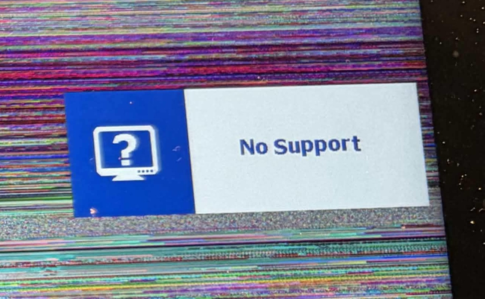

# TSG: Pen display does not support video signal format

## Overview

This condition arises when your pen display is receiving a video signal from your computer, but the signal format is incorrect.

## What you may see

* A message that says something like "No support"
* Colorful static
* A partial view of your computer desktop
* A buzzing sound

Examples of what you might see:

<figure><figcaption></figcaption></figure>

<figure><figcaption></figcaption></figure>

## What it means

The pen display is having trouble handling the specific signal and its settings.

## Some things to try

* Test with a different refresh rate
* Test with a lower resolution
* Test with a different video port on your computer (a different HDMI port, DisplayPort, etc.)
* Test with a different HDMI source (Xbox, camera, laptop, etc.)
* Test with a different HDMI cable

## Links

[**r/XPpen - "No Support" but screen stays on and makes loud buzzing sound.**](https://www.reddit.com/r/XPpen/comments/1v27xsa/no_support_but_screen_stays_on_and_makes_loud/) 2026-07-20
