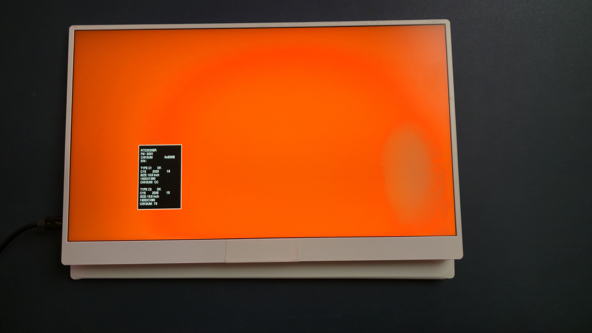
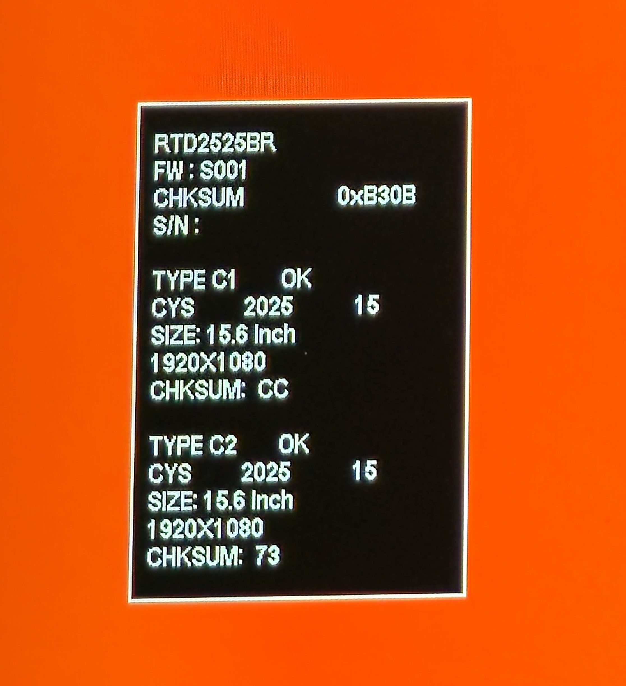

# TSG: Pen display keeps flashing different colors every few seconds

## Overview

If your pen display is showing flashing colors every few seconds, it ultimately means that it is not getting a video signal. This is a different visual effect from the "NO SIGNAL" problem. See: [TSG: Pen display shows NO SIGNAL message](tsg-no-signal.md)

## Symptoms

The screen cycles between a small set of colors. Usually the colors shown are RED, GREEN, BLUE, BLACK, and WHITE. Each color is shown for a few seconds before it switches to the next.

You may also see a box with various bits of technical information, such as Serial Number, Size, Resolution, and Checksums.

<figure><figcaption></figcaption></figure>

<figure><figcaption></figcaption></figure>

<figure><figcaption></figcaption></figure>

<figure><figcaption></figcaption></figure>

## Notes

* Since the screen is showing you a message, it's clear that power is NOT the problem. The tablet is getting enough power.
* In my experience:
  * I've seen this happen when the computer is asleep or off, but still connected to the tablet.
  * Port selection matters. I have seen it happen with some ports but not with others. For example, on one computer it happens if the video signal is coming from my computer's USB-C port but not when it is coming from a DisplayPort port.
