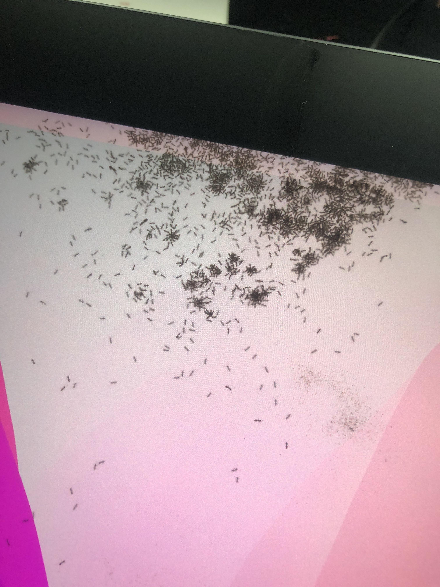

# TSG: Insects in a pen display

## Examples of insects between the display panel and glass

A video of a live bug (spider) inside a pen display



## Insect invasion

Usually people find one bug in their display. In some rare cases, there may be more. See the example below from a [**reddit thread**](https://www.reddit.com/r/wacom/comments/12nnhdc/ants_in_my_wacom_fml/).

The original poster mentioned in the comments that he did have some success: "I’ve managed to get most of them out by shaking the absolute sh\*t out of it and using a can of compressed air and bug spray."

