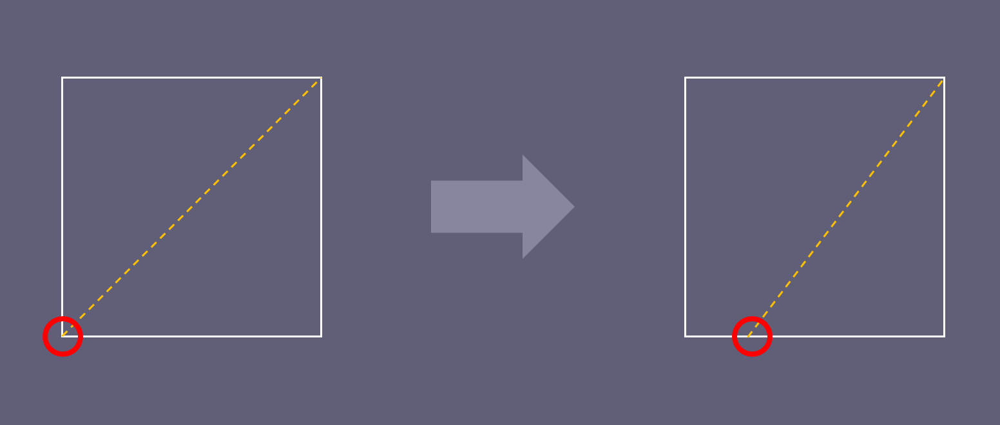

# TSG: Pen draws while hovering

## Overview

Normally, your pen should only draw or "click" when you press down on the tablet. If it's always drawing even while you are hovering (not touching the tablet), then something is very wrong.

This is a very common problem people run into. Sometimes it happens the first time they start using the tablet and sometimes only after years have passed.

## Causes

The two most common causes of this problem are:

* There is something wrong with the nib.
* Something is physically wrong with the pen internals. You'll need a replacement.
* The driver is having a temporary problem. Often resolved by restarting the computer.

## Check if the problem happens in the driver app

Instructions here: [DIAG: Testing pressure in the tablet driver](diag-pressure-in-tablet-driver.md). If the problem does not occur in the driver app, it indicates the problem may be app-specific.

## Things to try

Try the [Common drawing troubleshooting steps](common-drawing-tsg-steps.md).

### Reseat the nib

Try taking the nib out and putting it back in. While it is out, look for any damage.

### Replace the nib

Your tablet probably came with some extra nibs. Try replacing the nib with one of the extras.

### **Adjust the pressure curve**

Sometimes a pen is reporting pressure even when it isn't in contact with anything.

In the tablet driver, try dragging the lower left point of the pressure curve to the right until the pen stops drawing while hovering.

<figure><figcaption></figcaption></figure>

## If nothing helps

If the problem continues, then contact support: [Contacting support](../basics/support.md).
