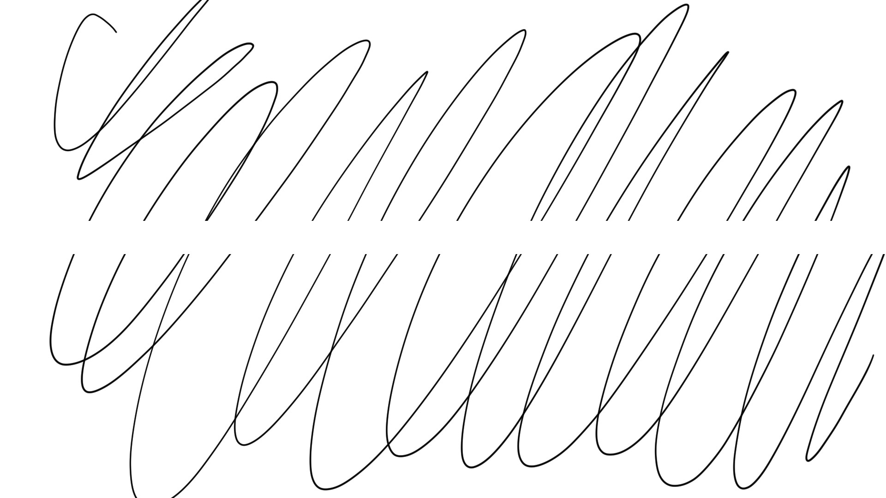
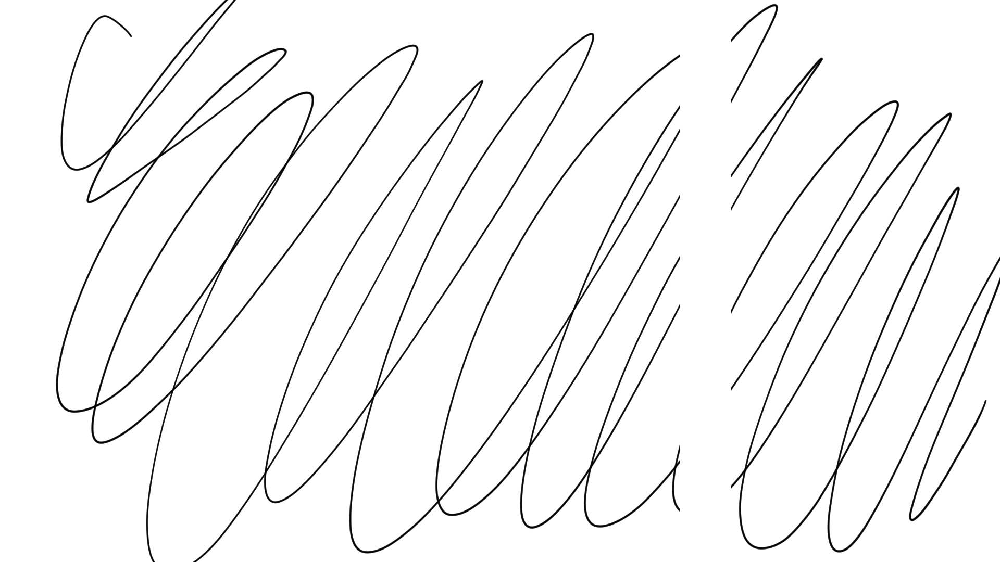

# TSG: Pen skipping vertical or horizontal bands

## Overview

This will manifest as vertical or horizontal bands that the pen seems to ignore. These bands will extend across the full active area of the tablet.

## Examples

Missing horizontal bands will look like this:

Missing vertical bands will look like this:

## Causes

* Usually this seems to be a hardware issue with the digitizer in the tablet.
* It **might** also be caused by electromagnetic interference.

## Things to try

Again, this is usually a hardware issue that cannot be fixed. But it is worth trying some of these steps just in case they might help.

* Restart the computer.
* Reinstall the driver.
* Test the tablet with another computer.
* Check if it happens in multiple applications.
* Check if it happens in the pressure test region of the tablet driver.
* If the problem persists, contact support: [Contacting support](../basics/support.md).

## Reddit threads

* [**r/wacom - Can someone tell me what's going on here?**](https://www.reddit.com/r/wacom/comments/13ls32y/can_someone_tell_me_whats_going_on_here/) 2023-05-19
*
