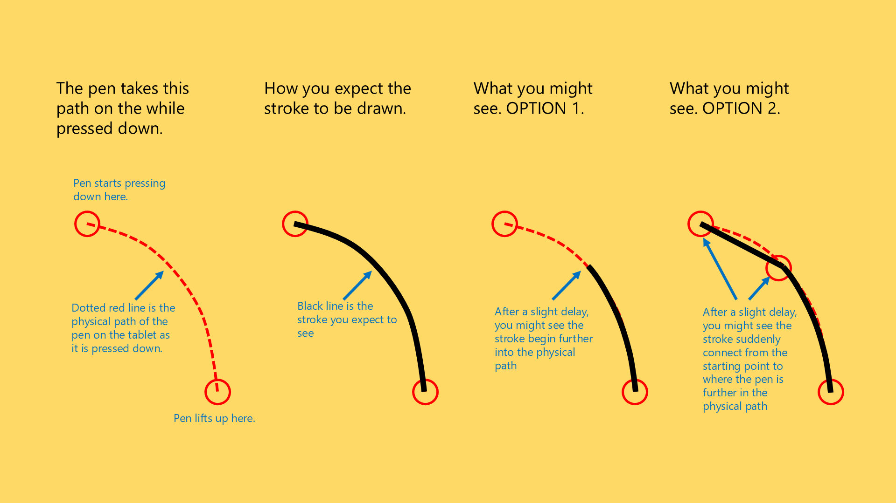

# TSG: Delay and straight lines or gaps at start of strokes

## Overview

This problem happens on Windows due to some interaction between the Windows Ink system and an application that uses the pen.

## Symptoms

When drawing a stroke (for example, a simple curve), you may notice that there is a slight delay before something is drawn. The resulting stroke will either:

* (a) skip over the beginning part of the stroke
* or (b) have a straight line drawn from where you put the pen down to a little later in the stroke.

<figure><figcaption></figcaption></figure>

## Other manifestations

The same delay at the beginning of dragging the pen can manifest in other user experiences. For example, you might see it as a small delay when first moving a slider. As you move the pointer with the pen, the slider will not move for several millimeters and then suddenly snap to the location of the pen.

## Examples

## .png>)

## Diagnostic questions to answer

* Does it happen in a specific app or all apps?
* Does it happen in this online app? [SevenPens Tablet Tester](../resources/sevenpens-tablet-tester.md)
* Does it happen in the driver pressure test region?

## Potential solutions

* Restart the computer
* Try [Disable the press-and-hold ring in Windows](../guides/platforms/windows/disable-the-press-and-hold-ring-in-windows.md)
* Try [Configure Windows Ink for apps](../guides/platforms/windows/winink/winink-config-apps.md) then restart the app
  * and if that doesn't solve it, then also try [Configure Windows Ink in the tablet driver](../guides/platforms/windows/winink/winink-config-driver.md) and then restart the app.

## Links

* ([https://www.reddit.com/r/wacom/comments/sa6wjd/is\_this\_kind\_of\_thing\_supposed\_to\_happen\_when\_im/](https://www.reddit.com/r/wacom/comments/sa6wjd/is_this_kind_of_thing_supposed_to_happen_when_im/))
* ([https://www.reddit.com/r/Windowsink/comments/ao0kvs/is\_this\_just\_a\_non\_issue\_for\_microsoft\_windows\_ink/](https://www.reddit.com/r/Windowsink/comments/ao0kvs/is_this_just_a_non_issue_for_microsoft_windows_ink/))
* ([https://www.zbrushcentral.com/t/windows-ink-api-support/214256](https://www.zbrushcentral.com/t/windows-ink-api-support/214256))
* ([https://forums.getpaint.net/topic/113173-the-first-5mm-of-a-freehand-line-are-straight-when-using-a-tablet/](https://forums.getpaint.net/topic/113173-the-first-5mm-of-a-freehand-line-are-straight-when-using-a-tablet/))
