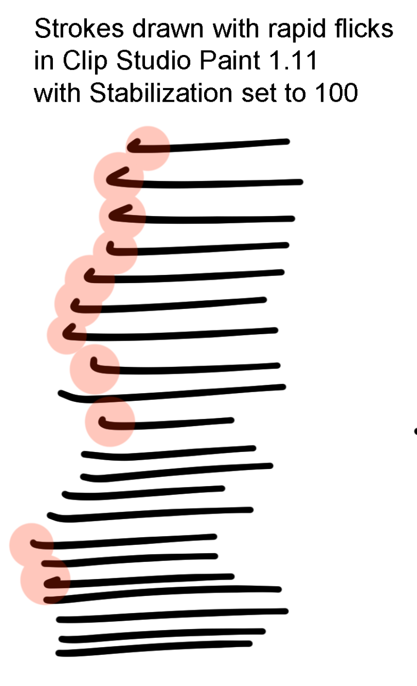
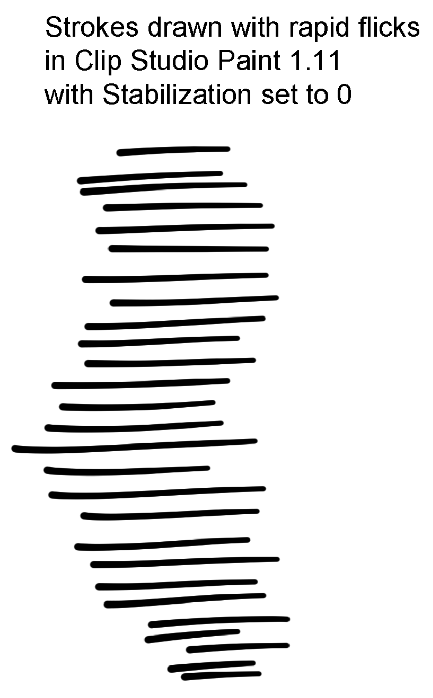
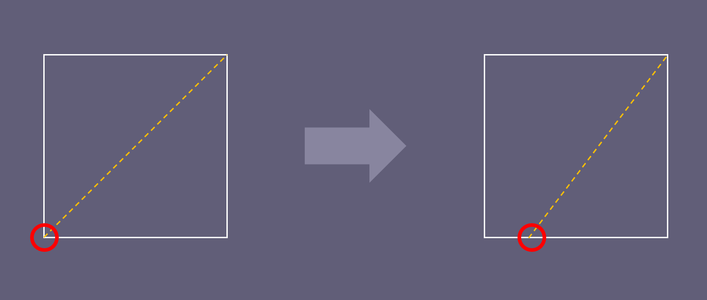

# TSG: Hooks at start of strokes

## Overview

These "hooks" often seem to be an artifact of various pen smoothing/stabilization techniques..

## Smoothing

In the example, lots of quick flicks were used to draw several strokes with lots of smoothing applied. You can clearly see that some lines have hooks at the beginning.

Below, the same style of flicks was used to draw strokes, but this time the smoothing was set to zero.

## Angle of fast stroke

When making fast strokes one after the other, there is a tendency for the hand to move the pen in a bit of a circular motion. So the initial point of contact is not where you want the stroke to begin. As your hand moves the pen to the correct location, this can create the hook.

I have found that I can reduce the hooks by:

* Being more careful about the stroke.
* Drawing more slowly.

## Pressure curve

Another contributing factor is that your pen may have a very low IAF and so is sensitive to that initial contact.

A low IAF is great, but if you are doing a lot of strokes, the sensitivity can result in more hooks. Consider adjusting your pressure curve as shown below.

<figure><figcaption></figcaption></figure>

## Links

* [https://www.reddit.com/r/ClipStudio/comments/zkvu0k/how\_remove\_that\_hook\_or\_s\_in\_the\_beginning\_and/](https://www.reddit.com/r/ClipStudio/comments/zkvu0k/how_remove_that_hook_or_s_in_the_beginning_and/)
