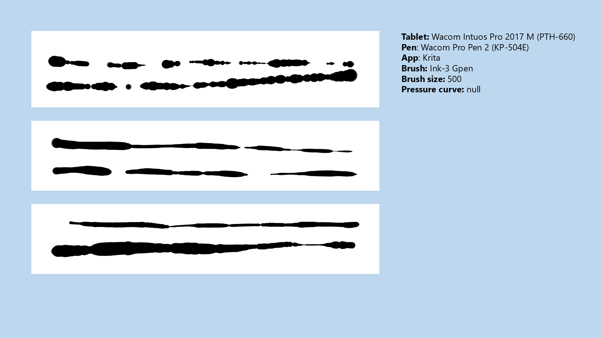
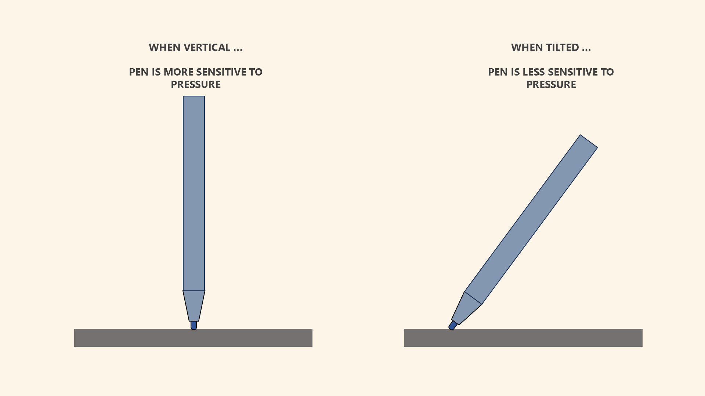
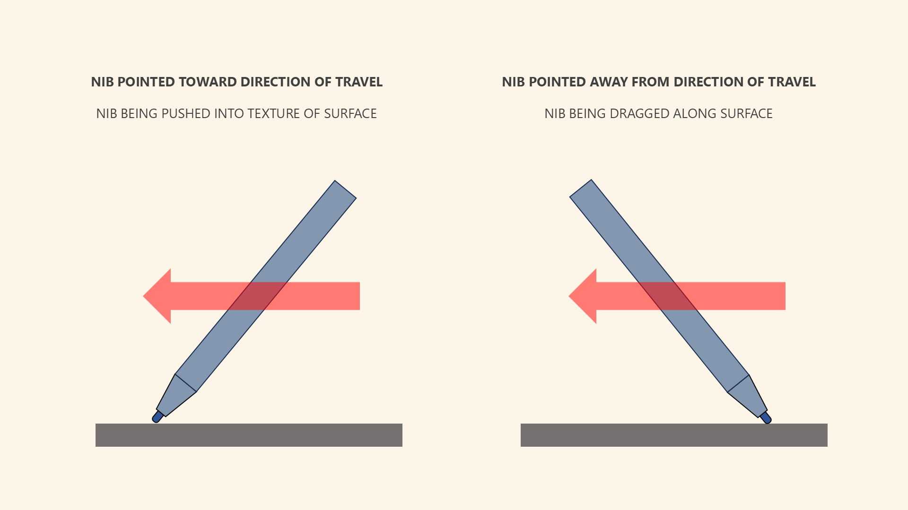

# TSG: Low pressure drawing problems

## Overview

When drawing at low pressure, you can experience pressure instability, and this can make your strokes look bad. To learn more about the problem itself, see [Drawing at low physical pressure](../core/pressure/drawing-low-pressure.md).

## Examples

<figure><figcaption></figcaption></figure>

## Techniques to address the problems

### Draw with higher pressure

Fundamentally, these problems happen because you're drawing at low pressure. Maybe this is because you want very thin strokes. Consider drawing at higher pressure and reducing your brush size.

### Tilt the pen more

Drawing tablet pens are more sensitive to pressure when they are held more vertically. This vertical orientation can exacerbate pressure stability issues. When tilted, some of the physical pressure applied to the nib is not transferred to the pressure sensor, but to the shell of the pen itself. While this reduces pressure sensitivity, it also has the effect of stabilizing the pressure readings a bit.

Many pens that exhibit severe pressure stability problems when held vertically will not show those problems if you're holding them at a more normal angle as you draw.

<figure><figcaption></figcaption></figure>

### Point the nib away from the direction the pen is moving

There is an interaction between the direction the pen is moving and the direction the nib is pointing.

If you point the nib TOWARD the direction the pen is moving, that means the pen may pick up more of the surface texture, which can translate into pressure readings that bounce around a lot.

Instead, try pointing the nib AWAY from the direction of travel. In general, I found that this produces fewer weird pressure artifacts.

<figure><figcaption></figcaption></figure>

### Use a Pressure curve

Pressure curves can mitigate low-pressure problems. There are two techniques you can apply here.

The first is to decrease sensitivity at the lower end of physical pressure. This will reduce some of the wild swings you might see.

Another technique is simply to ignore the lower end of physical pressure near the initial activation force. This essentially increases the IAF of the pen.

<figure><figcaption></figcaption></figure>

### Use pressure smoothing

Some applications offer pressure smoothing. Pressure smoothing can also diminish the effects of any sudden changes in pressure readings that might be occurring at low pressure.
