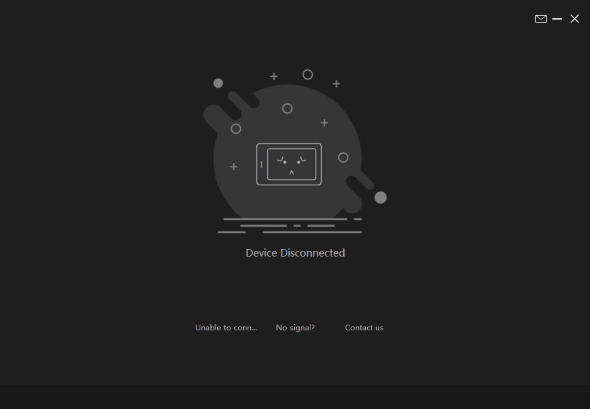
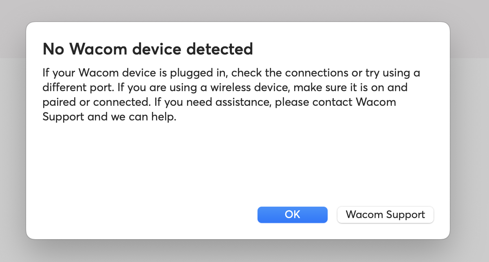
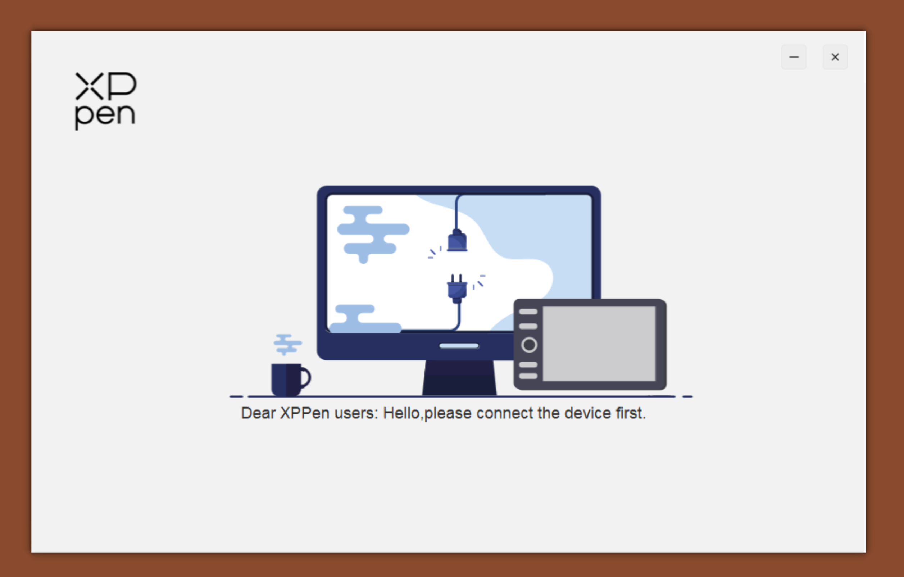

# TSG: Tablet driver does not detect the tablet

## Overview

The "tablet not connected/detected" problem is fundamentally that your driver cannot "see," "find," or "communicate" with the drawing tablet. The driver will often claim that the tablet "is not connected" or "is not detected." This my happen EVEN IF the tablet is connected with the correct cables.

* If this happens with a **pen tablet (a screenless tablet)**, then the tablet isn't functional at all.
* If this happens with a **pen display (a screen tablet)**, the display will work, but you will not be able to use the pen. The pen display works only as a monitor.

## Keeping it real


I want to be candid with you. If simple cabling issues do not cause this problem, it is usually difficult to diagnose and solve. In those cases, I have never discovered a consistent solution or a root cause.


## Driver message

Here are several examples of how the driver indicates the tablet is not connected.



<figure><figcaption></figcaption></figure>



<figure><figcaption></figcaption></figure>



<figure><figcaption></figcaption></figure>



## Why this error van be very confusing

The problem can occur: EVEN IF YOUR TABLET IS CORRECTLY PHYSICALLY CONNECTED TO THE COMPTUER

Your operating system may "beep" when you plug the tablet in and may even list the tablet as a device. At the same time, the driver may insist the tablet is not connected.

## What is not being detected

**The digitizer**

Your tablet is a plastic shell that contains at least one component — the tablet digitizer. This digitizer is the fundamental component that interacts with the pen. When a driver says your tablet is not connected, it refers to this digitizer.

For a pen display (screen tablet), there is another component — the screen. Your computer detects the screen separately from the tablet digitizer. This explains why the display still works.

**Ignore messages about keyboards**

The digitizer is the primary component of a pen tablet (screenless tablet), although some pen tablets have other components. You may, for example, see your tablet detected as a keyboard because it has keyboard-like buttons.

## NO SIGNAL for pen displays

Another kind of connection problem is the "NO SIGNAL" problem. It has nothing to do with the digitizer and is a completely unrelated topic. It means a pen display cannot detect a video signal from the computer. If you are experiencing the NO SIGNAL problem, then go here: [TSG: Pen display shows NO SIGNAL message](tsg-no-signal.md).

## Basic troubleshooting

* Restart the computer. This sometimes resolves the problem.
* Uninstall and reinstall the driver. Then restart the computer.
* Check if there is a more recent version of the driver. Install it. Then restart the computer.
* If you are using a pen display, verify it is getting enough power.

## Connection troubleshooting

* Make sure your USB port can send and receive data by testing with other devices such as a keyboard or mouse.
* Try unplugging other USB devices, leaving only the tablet, then plug the other devices back in.
* If you have a USB hub, try not using it. You can also try a different hub.
* Check that the USB ports and cable ends are clean. Remove any lint or debris.
* Try a different USB cable. Make sure the USB able supports data, not only power.
* Try a different USB port.
* Unplug and reconnect the USB cable.
* Check your tablet documentation. Some tablets have a "reset" option.

## Test the tablet with another computer

The issue may be specific to your computer, so try with another computer.

* If it doesn't work there, then that suggests the tablet itself is having problems.
* If it does work there, then retry with your own computer.

## 3-in-1 cable: Check that the data cable is not connected to power

A 3-in-1 cable often has three ends:

* USB-A or USB-C for power - this often has a red end or a red flag on it
* USB-A for data
* HDMI

Things to try:

* Double-check how it is connected.
* Make sure all three cables are connected.
* The cable for power (usually marked with red plastic or a red label) should go into a power adapter.

## Reset the tablet

* This is an option for SOME tablets. More here: [DIAG: Resetting a drawing tablet](diag-reset-drawtab.md)

## Windows > Check if Windows PNP drivers work

Windows has some limited built-in support for tablets. Not all tablets work with Windows PNP, but many do. Try this test: [DIAG: Testing with Windows PNP drawing tablet drivers](diag-windows-pnp-tablet-drivers.md)

If it works correctly with PNP drivers, it points to a problem with the manufacturer's driver rather than the tablet hardware.

## Windows > Power options for the tablet

Some people say this has helped them. I'm not sure.

* In **device manager**, select **View > By container**
* Find your tablet
* Under it will be a list of devices
* For each device under the tablet, right-click and select **Properties**

Uncheck **Power Management > Allow the computer to turn off this device to save power** if that option exists for the device.

## Manufacturer support pages

* **Wacom**: What does the error message “A supported tablet is not found on the system” or "No Wacom device connected to your computer" mean and how do I fix it? ([**link**](https://support.wacom.com/hc/en-us/articles/1500006339862))
* **Huion**: What To Do When Huion Driver Shows Device Disconnected? ([**link**](https://support.huion.com/en/support/solutions/articles/44001163422-what-to-do-when-huion-driver-shows-device-disconnected-))

## Time

Sometimes just waiting out the problem is all you can do. Some people report that they leave their tablet disconnected from their computer for a few days, and then afterwards it just starts working again.

Both times I have encountered this problem, nothing I did seemed to work. I waited, and it eventually resolved itself.

## Hardware modification

I do not recommend opening your tablet, as it will likely void your warranty. However, people have addressed this problem on some models by modifying internal hardware.

* Huion Kamvas 22 Plus modification: [**r/huion - DIY Huion Kamvas 22 Plus Fix for Device Disconnected / pen stopped working.**](https://www.reddit.com/r/huion/comments/1hl1ozv/diy_huion_kamvas_22_plus_fix_for_device/) 2024-12-23

## Still not solved?

If none of these suggestions are helping, then contact support: [Contacting support](../basics/support.md).

In the meantime, you may be able to use alternative drivers on Windows:

* Windows PNP drivers: [Windows PNP support for drawing tablets](../guides/platforms/windows/windows-pnp-support.md)
* OpenTabletDriver: [Install OpenTabletDriver on Windows](../guides/drivers/opentabletdriver/otd-windows-install.md)

## Notes

* When you plug in the tablet or unplug the tablet, check if the computer makes a "beep". This at least indicates that the computer is aware that there is some device there.
* Sometimes this problem is sporadic. I've had it personally occur with a tablet and after about 30 minutes of restarts, things just started working again.
* Some vendors like Huion recommend disabling antivirus when reinstalling the drivers. I do not recommend this, but some people say it has helped.

## Other threads

* 2025-01-13 - [**r/huion - This might also help u with "Device Disconnected" screen is working fine but pen is not working. I tried this process and it worked for me**](https://www.reddit.com/r/huion/comments/1i0g95y/this_might_also_help_u_with_device_disconnected/) 2025-01-13
*
