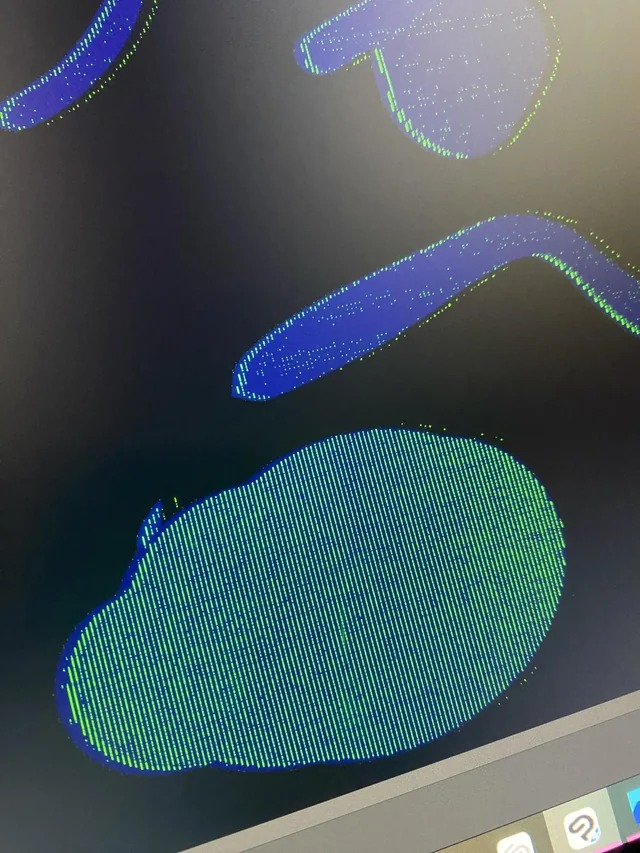
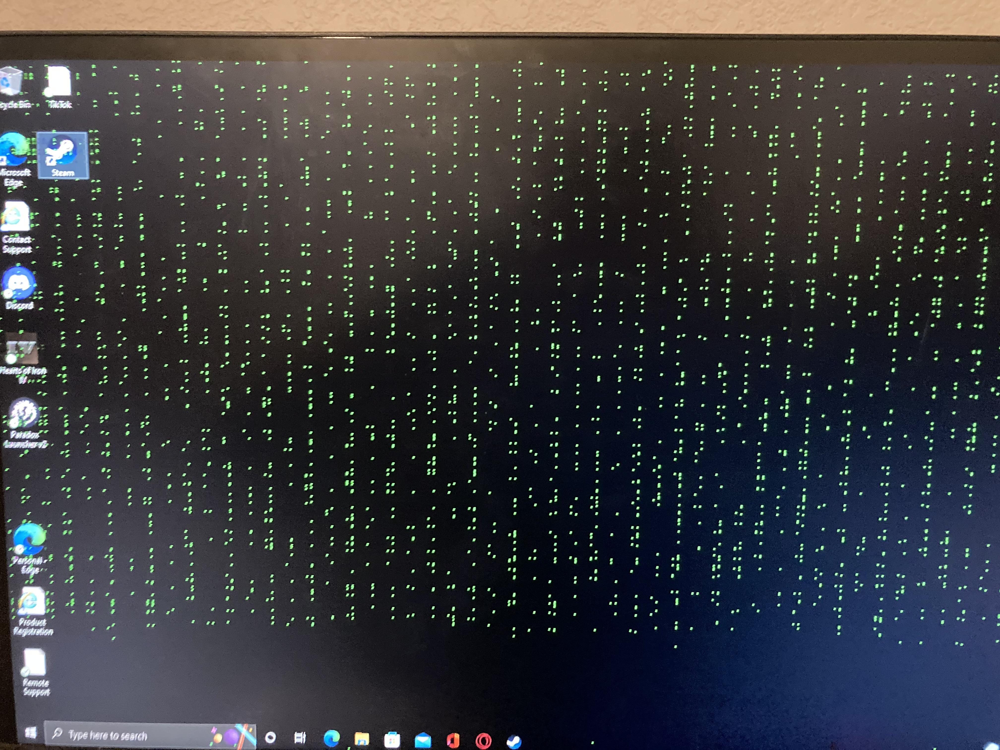

# Troubleshoot pixel noise on display

## Photo Examples

.jpg>)

## Video examples

this video gives an example ([https://www.youtube.com/watch?v=nTGG1NiF2MY](https://www.youtube.com/watch?v=nTGG1NiF2MY)) with red pixels

## Appearance

* This manifests as certain pixels lighting up and flickering
* Even if the input signal isn't changing you may see the pixels rapidly flicker
* Usually it will be a single color. It very often happens with the GREEN component of a pixel. But can happen with RED (LESS COMMON) or BLUE (UNCOMMON).&#x20;
* You may notice that the pixels light up in vertical or horizontal stripes&#x20;
* This problem is not related to "STUCK PIXELS". In this case which pixels light up is dynamic and depends on what is shown on the display.

### Sources of the problem

* The ultimate source of the problem can be:
  * The display panel
  * The cabling (cables & ports)
  * The GPU that is sending the display signal

## Cabling

* This problem seems to be associated with the connection to the display and is often a cabling issue:
  * Sometimes the cable is bad
  * Sometimes the cable is sagging or stretched too tightly and can cause this problem as it puts pressure on the ports&#x20;
  * Sometimes it is due to the ports the cable is using
  * It can occur with HDMI, DisplayPort, and USB-C cables/ports&#x20;

## Try

* Using different cables
* Use a different port
* Use a different kind of port (for example, switch from HDMI to Displayport)
* Test with another computer
* Checking the refresh rate
* Test with a lower resolution
* If you are unable to resolve, you should contact your manufacturer's support
